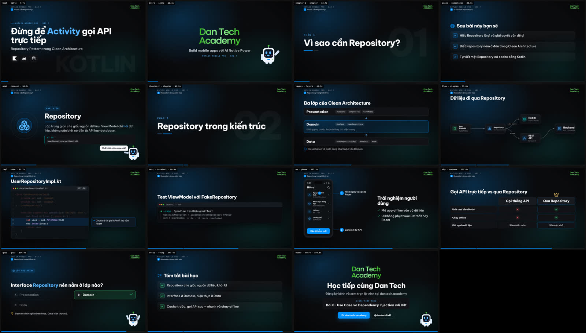
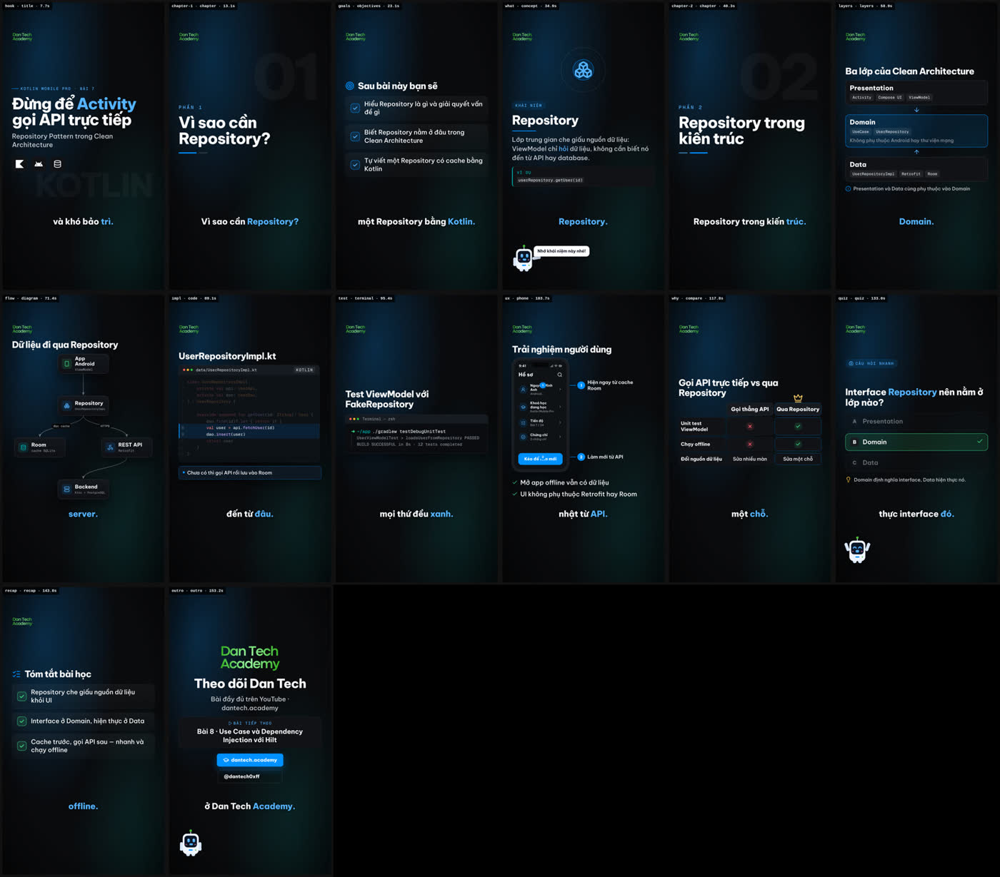

<a id="top"></a>

<div align="center">

<picture>
  <source media="(prefers-color-scheme: dark)" srcset="assets/brand/dan-tech/logo-wordmark.png">
  
</picture>

# md-to-video-hyperframes

### The programming-lesson video engine behind Dan Tech

Turn a topic, a notes file or an article into a narrated lesson video whose visuals appear exactly when the narrator mentions them.
**16:9 for YouTube (with chapters)** and **9:16 for Shorts** come from the same script, rendered deterministically with HyperFrames + GSAP.

[](https://github.com/dantech0xff/md-to-video-hyperframes/actions/workflows/ci.yml)
[](LICENSE)
[](https://nodejs.org)
[](https://www.typescriptlang.org/)
[](https://hyperframes.heygen.com)
[](https://dantech.academy)

[**Tiếng Việt**](README.md) · [**Full docs (Vietnamese)**](README.full.md) · [**Pipeline architecture**](docs/dan-tech/lesson-pipeline.md) · [**Quick start**](#quick-start) · [**Roadmap**](#roadmap)

</div>

---

## What this is

md-to-video-hyperframes is the lesson-video production tool of [Dan Tech](https://dantech.academy). It targets programming, software architecture and mobile fullstack topics: Kotlin/Android, Clean Architecture and backends for mobile apps. Narration is in Vietnamese.

You give it a topic, a `.md`/`.txt` file or a URL. An AI agent (the `/create-lesson-video` skill in Claude Code or Antigravity) writes the lesson script. A deterministic pipeline does the rest: speech synthesis with word-level timestamps, visuals synced to those words, the audio mix, the render, and subtitles plus a YouTube chapter list.

> Since September 2026 this repository is detached from its original fork network and developed independently, focused on lesson videos. The older 9:16 news-video pipeline still works but is no longer the focus; see [News pipeline (legacy)](#news-pipeline-legacy).

## Direction

1. **Lessons first.** New features serve programming lessons: code, diffs, terminals, architecture diagrams, app screens, quizzes.
2. **One script, two formats.** A long 16:9 lesson with chapters for YouTube and a 9:16 cut for Shorts share the same content and voice track.
3. **Visuals follow the voice.** Cue markers in the narration are pinned to the TTS word timings, so every point, code line and arrow appears on the word that introduces it.
4. **Markdown-first.** The goal, as the repository name says, is to write lessons in Markdown and compile them deterministically into a script, so instructors never edit JSON. Today the script is `script.json` v2; the `lesson.md` compiler is on the [roadmap](#roadmap).
5. **AI for the creative part, code for production.** The agent only writes the script. Rendering is deterministic: the same input produces the same frames, which makes review and re-renders cheap.
6. **Rebrandable.** The Dan Tech brand kit is the default, but logo, colours, CTA and mascot all live in `assets/brand/<id>/brand.json`.

## Demo

Storyboard of the sample lesson [`examples/lessons/repository-pattern`](examples/lessons/repository-pattern/script.json), "Repository Pattern in Clean Architecture": 15 scenes, 157 s in 16:9 and 154 s in 9:16.



<details>
<summary><b>9:16 (Shorts) storyboard of the same script</b></summary>



</details>

A Short written for 9:16 from the start: [`examples/lessons/short-launch-vs-async`](examples/lessons/short-launch-vs-async/script.json) (Kotlin Coroutines, `launch` vs `async`, `whiteboard` style).

## Features

- **Word-level sync.** Cues such as `{1}` `{L3-5}` `{show:api}` `{hl:db}` `{flow:app>api>db}` `{tap:1}` `{zoom:api}` `{answer}` `{pause:4}` go straight into the narration.
- **15 scene types for technical teaching:** `title`, `statement`, `objectives`, `concept`, `bullets`, `code` (Shiki, typing effect, line focus with notes), `diff`, `terminal`, `diagram` (auto-layout, data packets travelling along edges), `layers`, `phone` (app screen with callouts), `compare`, `quiz` (countdown, then answer reveal), `recap`, `image`. Intro, chapter cards and outro are added automatically.
- **The Dan Tech template system:** 23 templates in 16:9 and 9:16 across five families. Lessons: `lesson.hook`, `lesson.compare`, `lesson.concept`, `lesson.quiz`. News: `news.breaking`, `news.top-n`, `news.quote`, `news.lower-third`, `news.globe`. Infographics: `data.big-number`, `data.dumbbell`, `data.line`, `data.waffle`, `data.timeline`. Energy: `energy.punch`, `energy.myth-fact`, `energy.before-after`, `energy.big-rank`. 3D with three.js: `3d.layers`, `3d.hero-object`, `3d.phone`, `energy.punch-3d`, `news.globe`. Brand rules (one font, no borders, no dot separators, pills instead of eyebrows) and the energy rules (hook beat, count-ups, one impact per interrupt) are built in. See [docs/dan-tech/templates.md](docs/dan-tech/templates.md) and [the showcase](examples/lessons/templates-showcase/script.json).
- **5 visual styles:** `dantech`, `dantech-punch` (the same look with faster motion), `blueprint`, `whiteboard`, `terminal`. Each has its own colours, fonts, code theme, easing, transitions and sound mood.
- **Karaoke captions:** spoken words white, the current word on an accent block, upcoming words dimmed, in each family's colours.
- **Optional mascot:** a brand kit can define the built-in "Dan Bot" or per-pose PNG art. The Dan Tech brand has none.
- **Complete sound design:** event-driven SFX and background music, both **picked by file name**; music ducks under the voice; the whole mix is normalised to −14 LUFS.
- **Two voice profiles:** `free` (Edge TTS, no API key, with the `tech-vi` pronunciation lexicon for English terms) and `clone` (the instructor's voice via ElevenLabs `eleven_v3` or LucyLab).
- **Publishing kit:** `video.mp4`, `captions.srt`/`.vtt`, `chapters.txt` (paste into the YouTube description), `script.txt`, `storyboard.jpg`. The 9:16 cut has burned-in karaoke captions.
- **Review before rendering:** a storyboard in about a minute that captures each scene's hero frame; `--preview 60:75` renders a short clip with audio to check motion.
- **Correct Vietnamese typography:** self-hosted fonts with the `vietnamese` subset (Be Vietnam Pro, Geist Mono, Space Grotesk, Chakra Petch, Patrick Hand).

## Quick start

**Requirements:** Node.js 22+, FFmpeg and ffprobe on `PATH`, Chrome or Chromium. HyperFrames downloads Chrome on the first render; the storyboard looks for a local Chrome and, if none is found, asks you to run `npx hyperframes browser ensure` or set `CHROME_PATH`.

```bash
git clone https://github.com/dantech0xff/md-to-video-hyperframes.git
cd md-to-video-hyperframes
npm install
cp .env.example .env.local   # the default free voice (Edge TTS) needs no API key
```

> Install FFmpeg: `winget install Gyan.FFmpeg` (Windows) · `brew install ffmpeg` (macOS) · `sudo apt install ffmpeg` (Ubuntu/Debian).

**Render the sample lesson:**

```bash
npm run lesson:storyboard -- examples/lessons/repository-pattern/script.json   # review the storyboard (~1 min)
npm run lesson -- examples/lessons/repository-pattern/script.json              # render 16:9 + 9:16
```

If `assets/sfx/` and `assets/music/` are empty, the pipeline generates a placeholder sound pack in `_starter/` so the first run still has audio. A 1080p30 render takes about 5–6× the video length on 4 cores, so run long lessons in the background.

**Create a new lesson with an AI agent.** In Claude Code (or the Antigravity IDE chat):

```text
/create-lesson-video Repository Pattern trong Clean Architecture
/create-lesson-video notes/kotlin-flow.md
/create-lesson-video https://kotlinlang.org/docs/coroutines-basics.html
```

The agent reads the material, outlines the lesson, writes `lessons/<slug>/script.json`, checks it with a storyboard, renders it and drafts `youtube.md` (title, description with chapters, tags). Ask explicitly for a Short and it writes a separate 45–90 s 9:16 script instead of squeezing the long lesson into a vertical frame.

No AI agent? Write `script.json` by hand following the [script guide](README.full.md#viết-kịch-bản-script-v2) (Vietnamese) and the [scene catalog](.claude/skills/create-lesson-video/reference/scenes.md), then run the two commands above.

## Commands

| Command | What it does |
|---|---|
| `npm run lesson -- <script.json> [--format landscape\|portrait\|all] [--style …] [--preview 20:35] [--draft\|--high]` | Render the video (with a storyboard) |
| `npm run lesson:storyboard -- <script.json>` | Build `storyboard.jpg` only, for a quick review |
| `npm run lesson:frames -- <script.json>` | Layout check in seconds: estimated timings, no TTS or audio, storyboard only |
| `npm run lesson -- <script.json> --silent` | Full render without narration (estimated timings, SFX and music), for motion previews when no TTS service is reachable |
| `npm run audio:catalog [-- --style terminal]` | Write `catalog.json` for SFX and music and print what each style will pick |
| `npm run sounds:starter` | Generate the temporary placeholder sound pack in `_starter/` |
| `npm run voice:clone -- --name "…" samples/*.mp3 --save` | Clone the instructor's voice (ElevenLabs) and save it to `.env.local` |
| `npm run fonts:fetch` | Re-download the self-hosted Vietnamese-capable fonts |
| `npm run typecheck && npm test` | Type-check and run the tests (Vitest) |
| `npm run lint` | ESLint over `src/` and `scripts/` |
| `npm run env:check` | Check the environment: Node, ffmpeg/ffprobe, HyperFrames, `.env.example`, brand and styles |

`npm run lesson` also accepts `--fps 60`, `--crf 18` and `--no-storyboard`.

## Output

```text
lessons/<slug>/
├── script.json          # the v2 script (written by the agent or by you)
├── youtube.md           # title, description, tags (drafted by the agent)
├── voice/               # per-sentence TTS cache, shared by every format
├── landscape/           # 1920×1080 for YouTube
│   ├── video.mp4
│   ├── captions.srt · captions.vtt
│   ├── chapters.txt     # paste into the YouTube description
│   ├── script.txt
│   ├── storyboard.jpg   # full-size frames in storyboard/shot-NNN.png
│   └── preview.mp4      # when run with --preview
└── portrait/            # 1080×1920 for Shorts, Reels, TikTok (same set of files)
```

Everything the pipeline generates is already in `.gitignore`.

## Project layout

```text
md-to-video-hyperframes/
├── .claude/skills/          # Claude Code skills: create-lesson-video (main), create-news-video (legacy)
├── .agents/skills/          # the same skills for Antigravity IDE
├── src/
│   ├── lesson/              # lesson pipeline v2: schema, timing, voice, audio mix, composer, storyboard
│   │   ├── runtime/         #   GSAP runtime inlined into the composition
│   │   └── styles/          #   style packs: dantech, blueprint, whiteboard, terminal
│   ├── tts/                 # Edge TTS, ElevenLabs, LucyLab, Vbee, voice cloning, pronunciation lexicon
│   ├── render/              # HyperFrames runner (shared) + news-pipeline templates
│   ├── assets/              # FFmpeg helpers (shared), SFX picker and image fetcher for the news pipeline
│   ├── config.ts            # reads .env.local
│   └── pipeline.ts, cli.ts  # 9:16 news pipeline (legacy)
├── assets/
│   ├── brand/dan-tech/   # wordmark, colours, CTA (brand.json)
│   ├── fonts/               # self-hosted fonts with the Vietnamese subset
│   ├── lexicon/tech-vi.json # how the free voice pronounces tech terms
│   └── sfx/, music/         # your sound library, picked by file name
├── examples/lessons/        # sample scripts
├── scripts/                 # audio catalog, placeholder sounds, voice cloning, font fetching, SFX tools
├── docs/
│   ├── dan-tech/    # lesson pipeline architecture, gap analysis and roadmap
│   ├── news-pipeline.md     # news pipeline docs (legacy)
│   └── superpowers/         # original spec and plan of the news pipeline (archive)
├── tests/fixtures/          # test data
├── README.full.md           # full documentation (Vietnamese)
└── README.en.md             # this file
```

## Documentation

- [Full documentation](README.full.md) (Vietnamese): setup, configuration, writing v2 scripts, styles, audio, voices, rendering, troubleshooting, FAQ.
- [Lesson pipeline architecture and extension guide](docs/dan-tech/lesson-pipeline.md) (Vietnamese): adding a style, a scene type or another brand.
- [Gap analysis and roadmap](docs/dan-tech/2026-09-24-lesson-video-gap-analysis.md) (Vietnamese).
- `create-lesson-video` skill (English): [SKILL.md](.claude/skills/create-lesson-video/SKILL.md) · [scene catalog](.claude/skills/create-lesson-video/reference/scenes.md) · [narration and cues](.claude/skills/create-lesson-video/reference/narration.md) · [styles, sound, mascot](.claude/skills/create-lesson-video/reference/look-and-sound.md).
- Sound library naming (Vietnamese): [SFX](assets/sfx/README.md) · [music](assets/music/README.md).

## Roadmap

**Done (lesson pipeline v2):** brand kit and self-hosted Vietnamese fonts; v2 schema (lesson → chapters → scenes); word-level sync; quizzes with a countdown; SFX and music picked by file name, ducking, −14 LUFS; 4 styles and 9 transition types; code, diff, terminal, diagram, layers, phone and compare scenes; 16:9 and 9:16 from one script with subtitles and YouTube chapters; storyboard and preview; the Dan Tech template system (news, infographic, energy and three.js 3D templates, karaoke captions, `dantech-punch`).

**Next:**

- [ ] **Markdown-first:** a `lesson.md` → script v2 compiler (headings become chapters, code fences become code scenes, `:::quiz` becomes a quiz…).
- [ ] Automatic Shorts cut from long lessons, automatic thumbnails.
- [ ] Upgrade to HyperFrames 0.8.x: shader transitions and cloud rendering for 10–20 minute lessons.
- [ ] New scenes: charts/benchmarks, sequence diagrams, "try it yourself" exercises.
- [ ] A licensed SFX and music library, the instructor's cloned voice, an official mascot.

## News pipeline (legacy)

The repository still ships the older pipeline that turns a news article URL or a `.txt` file into a ~60 s vertical 9:16 video: the `/create-news-video <url|file>` skill, `npm run pipeline -- <script.json>` and `npm run rerender -- <output-dir>`. It is kept for compatibility; new work goes into the lesson pipeline. See [docs/news-pipeline.md](docs/news-pipeline.md) (Vietnamese).

## License and origins

- Released under the [MIT](LICENSE) license.
- The project started as a fork of [auto-video-gen](https://github.com/Cuongyd196/auto-video-gen) (CuongIT), itself derived from [Auto-Create-Video](https://github.com/hoquanghai/Auto-Create-Video) by Ho Quang Hai. The 9:16 news pipeline and the HyperFrames/TTS groundwork come from those projects, and the original copyright notice is kept in [LICENSE](LICENSE). The repository is now detached from that fork network and developed independently by Dan Tech.
- Built on [HyperFrames](https://hyperframes.heygen.com) (HeyGen), [GSAP](https://gsap.com), [Shiki](https://shiki.style), [Lucide](https://lucide.dev), [Simple Icons](https://simpleicons.org), [edge-tts-universal](https://www.npmjs.com/package/edge-tts-universal), [ElevenLabs](https://elevenlabs.io), [LucyLab](https://lucylab.io), [Zod](https://zod.dev) and [Vitest](https://vitest.dev). The self-hosted fonts are under the SIL OFL (see `assets/fonts/*/OFL.txt`).

## Contact

**Dan Tech**, *Build mobile apps with AI Native Power*

[Website](https://dantech.academy) · [YouTube](https://youtube.com/channel/UCwZM2_v4Y_vMb_JCjEJ15yw) · [GitHub](https://github.com/dantech0xff) · [Facebook](https://facebook.com/dantech0xff) · [LinkedIn](https://linkedin.com/in/dantech0xff) · [X](https://x.com/dan_0xff)

<div align="center">

**[Back to top](#top)**

</div>
