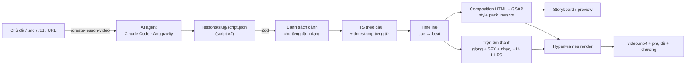

<a id="top"></a>

<div align="center">

# md-to-video-hyperframes: tài liệu đầy đủ

### Engine làm video bài giảng lập trình của Dan Tech

[**README**](README.md) · [**English**](README.en.md) · [**Kiến trúc pipeline**](docs/dan-tech/lesson-pipeline.md) · [**Pipeline tin tức (kế thừa)**](docs/news-pipeline.md) · [**dantech.academy**](https://dantech.academy)

</div>

> Bản tóm tắt nằm ở [README.md](README.md). Tài liệu này đi sâu vào cách dùng lesson pipeline v2.
> Người bảo trì muốn mở rộng pipeline (thêm style, thêm loại cảnh, thương hiệu khác) xem thêm
> [docs/dan-tech/lesson-pipeline.md](docs/dan-tech/lesson-pipeline.md).

## Mục lục

- [Tổng quan](#tổng-quan)
- [Cách hoạt động](#cách-hoạt-động)
- [Cài đặt](#cài-đặt)
- [Cấu hình](#cấu-hình)
- [Quy trình làm một bài giảng](#quy-trình-làm-một-bài-giảng)
- [Viết kịch bản (script v2)](#viết-kịch-bản-script-v2)
- [Cue: đồng bộ hình với lời](#cue-đồng-bộ-hình-với-lời)
- [Các loại cảnh](#các-loại-cảnh)
- [Style, thương hiệu và mascot](#style-thương-hiệu-và-mascot)
- [Âm thanh](#âm-thanh)
- [Giọng đọc](#giọng-đọc)
- [Render và duyệt](#render-và-duyệt)
- [Đầu ra](#đầu-ra)
- [Hiệu năng](#hiệu-năng)
- [Kiểm thử](#kiểm-thử)
- [Xử lý sự cố](#xử-lý-sự-cố)
- [FAQ](#faq)
- [Lộ trình](#lộ-trình)
- [Pipeline tin tức (kế thừa)](#pipeline-tin-tức-kế-thừa)
- [Giấy phép và nguồn gốc](#giấy-phép-và-nguồn-gốc)

---

## Tổng quan

md-to-video-hyperframes là engine sản xuất video bài giảng của [Dan Tech](https://dantech.academy). Nội dung trọng tâm là lập trình, kiến trúc phần mềm và mobile fullstack: Kotlin/Android, Clean Architecture, backend cho mobile. Lời thoại bằng tiếng Việt, thuật ngữ giữ nguyên tiếng Anh như cách lập trình viên vẫn nói.

Mỗi bài giảng ra hai định dạng từ cùng một kịch bản:

| Định dạng | Kích thước | Dùng cho |
|---|---|---|
| `landscape` | 1920×1080 | Bài giảng YouTube 3–12 phút, có thẻ chương, thanh tiến độ, danh sách chương cho phần mô tả |
| `portrait` | 1080×1920 | Shorts, Reels, TikTok; phụ đề karaoke in sẵn, bố cục dọc |

Dự án chia làm hai lớp:

- **Lớp sáng tạo:** skill `create-lesson-video` ([Claude Code](.claude/skills/create-lesson-video/SKILL.md), [Antigravity](.agents/skills/create-lesson-video/SKILL.md)) đọc tư liệu, lên dàn ý và viết kịch bản `script.json` v2 với lời thoại có cue.
- **Lớp sản xuất:** lesson pipeline v2 (`src/lesson/`, `npm run lesson`) biến kịch bản thành video một cách tất định: cùng kịch bản cho ra cùng khung hình.

Định hướng phát triển (chi tiết trong [README](README.md#định-hướng)): bài giảng là trọng tâm; một kịch bản cho hai định dạng; hình bám theo lời; tiến tới **Markdown-first**, tức viết bài bằng `lesson.md` rồi biên dịch sang kịch bản; thương hiệu thay được qua brand kit.

**Công nghệ**

| Lớp | Công nghệ |
|---|---|
| Runtime | Node.js ≥ 22, TypeScript 6, ESM, `tsx` |
| Render | [HyperFrames](https://hyperframes.heygen.com) ^0.4.34 (headless Chrome + FFmpeg), [GSAP](https://gsap.com) 3 |
| Hình ảnh | [Shiki](https://shiki.style) cho code, [Lucide](https://lucide.dev) và [Simple Icons](https://simpleicons.org) cho icon, font tự host có subset tiếng Việt |
| Giọng đọc | Edge TTS (`edge-tts-universal`), [ElevenLabs](https://elevenlabs.io), [LucyLab](https://lucylab.io); Vbee chủ yếu cho pipeline tin tức |
| Kịch bản | [Zod](https://zod.dev) 4, báo lỗi kèm đường dẫn tới đúng trường |
| Âm thanh | FFmpeg: `adelay`/`amix`, sidechain ducking, `loudnorm` hai lượt |
| Storyboard, preview | `puppeteer-core` |
| Kiểm thử | [Vitest](https://vitest.dev), `nock` |
| AI agent | Claude Code (`.claude/skills/`), Antigravity IDE (`.agents/skills/`) |

---

## Cách hoạt động



1. **Kiểm tra kịch bản** bằng Zod. Lỗi được in kèm đường dẫn, ví dụ `chapters.1.scenes.3.answer`.
2. **Lập danh sách cảnh** cho từng định dạng: cold open → intro sting → thẻ chương → các cảnh → outro.
3. **Chuẩn bị lời thoại:** tách cue `{…}` và khoảng lặng `{pause:N}` ra khỏi văn bản, áp từ điển phát âm nhưng vẫn giữ bản đồ vị trí ký tự để cue không bị lệch.
4. **Tổng hợp giọng** từng đoạn một lần rồi lưu cache, kèm thời điểm của từng từ.
5. **Dựng timeline:** đổi thời điểm của từ sang giây; mỗi cue thành một beat (hiện ý, soi dòng code, chạy gói dữ liệu, lộ đáp án…).
6. **Trộn âm thanh:** đặt giọng, chèn SFX theo sự kiện, nhạc nền lặp và tự hạ khi có lời, chuẩn hoá cả bài về −14 LUFS.
7. **Dựng composition:** HTML ở trạng thái cuối của mọi cảnh; runtime GSAP nhúng inline dựng một timeline duy nhất từ kế hoạch.
8. **Xuất:** phụ đề, danh sách chương, `script.txt`, storyboard, rồi HyperFrames render ra `video.mp4`.

Giọng được tổng hợp một lần và dùng chung cho mọi định dạng. Sơ đồ luồng chi tiết theo từng module nằm trong [lesson-pipeline.md](docs/dan-tech/lesson-pipeline.md).

---

## Cài đặt

| Thành phần | Phiên bản | Ghi chú |
|---|---|---|
| Node.js | ≥ 22 | `node --version` |
| FFmpeg + ffprobe | bản hiện đại | phải có trong `PATH`; dùng để trộn âm thanh, đo độ dài, tạo âm thanh mẫu |
| Chrome / Chromium | bất kỳ | HyperFrames tự tải khi render lần đầu. Storyboard và preview dò Chrome theo `CHROME_PATH`, `PUPPETEER_EXECUTABLE_PATH`, `HYPERFRAMES_BROWSER_PATH`, bản Chrome của HyperFrames, rồi các đường dẫn hệ thống |
| AI agent | tuỳ chọn | Claude Code hoặc Antigravity IDE, để agent viết kịch bản |
| API key TTS | tuỳ chọn | chỉ cần cho giọng clone (ElevenLabs hoặc LucyLab) |

```bash
git clone https://github.com/dantech0xff/md-to-video-hyperframes.git
cd md-to-video-hyperframes
npm install
cp .env.example .env.local        # mặc định giọng free, không cần API key

npm run typecheck && npm test     # kiểm tra cài đặt
```

| Hệ điều hành | Cài FFmpeg |
|---|---|
| Windows | `winget install Gyan.FFmpeg` |
| macOS | `brew install ffmpeg` |
| Ubuntu/Debian | `sudo apt install ffmpeg` |

Nếu storyboard báo không tìm thấy Chrome, chạy `npx hyperframes browser ensure` hoặc đặt `CHROME_PATH` trong `.env.local`.

---

## Cấu hình

Cấu hình nằm trong `.env.local` (chép từ [`.env.example`](.env.example), đã có trong `.gitignore`). Với bài giảng, cấu hình mặc định chạy được ngay.

| Biến | Mặc định | Ý nghĩa |
|---|---|---|
| `VOICE_PROFILE` | `free` | Giọng dùng khi kịch bản không ghi `voice.profile`: `free` (Edge TTS) hoặc `clone` |
| `CLONE_PROVIDER` | `elevenlabs` | Nơi lưu giọng clone: `elevenlabs` hoặc `lucylab` |
| `EDGE_TTS_VOICE` | `vi-VN-NamMinhNeural` (trong `.env.example`) | Giọng free: `vi-VN-NamMinhNeural` (nam) hoặc `vi-VN-HoaiMyNeural` (nữ) |
| `EDGE_TTS_RATE`, `EDGE_TTS_PITCH`, `EDGE_TTS_VOLUME` | `+0%`, `+0Hz`, `+0%` | Tốc độ, cao độ, âm lượng của giọng free |
| `ELEVENLABS_API_KEY`, `ELEVENLABS_VOICE_ID` | trống | Giọng clone qua ElevenLabs; `npm run voice:clone -- … --save` tự ghi `ELEVENLABS_VOICE_ID` |
| `ELEVENLABS_MODEL_ID` | `eleven_v3` | Tiếng Việt cần `eleven_v3` hoặc `eleven_flash_v2_5`; `eleven_multilingual_v2` không hỗ trợ tiếng Việt |
| `VIETNAMESE_API_KEY`, `VIETNAMESE_VOICEID` | trống | Giọng clone qua LucyLab |
| `SFX_DIR`, `MUSIC_DIR` | `assets/sfx`, `assets/music` | Trỏ tới thư viện âm thanh đặt ngoài repo |
| `BRANDS_DIR` | trống | Thư mục chứa thêm brand kit (`<id>/brand.json` và logo), được tìm trước `assets/brand` |
| `FFMPEG_PATH`, `FFPROBE_PATH` | `ffmpeg`, `ffprobe` trong `PATH` | Dùng một bản FFmpeg cụ thể thay cho bản trong `PATH` |
| `CHROME_PATH` | tự dò | Chrome cho storyboard và preview |
| `TTS_CONCURRENCY` | `1` | Số đoạn TTS tổng hợp song song |

Các biến `TTS_PROVIDER`, `VIDEO_THEME` và `TIKTOK_*` thuộc [pipeline tin tức](docs/news-pipeline.md); `VBEE_*` chỉ cần khi dùng Vbee. Lưu ý `TTS_PROVIDER` vẫn được kiểm tra khi khởi động mọi pipeline: nếu đặt `lucylab`, `elevenlabs` hay `vbee` thì phải điền key tương ứng. Nếu chỉ làm bài giảng, cứ để `edge-tts`.

---

## Quy trình làm một bài giảng

1. **Chuẩn bị tư liệu:** một chủ đề, một file ghi chú `.md`/`.txt`, hoặc URL tài liệu.
2. **Viết kịch bản:** gõ `/create-lesson-video <chủ đề | file | URL>` trong Claude Code hoặc Antigravity, hoặc tự viết `lessons/<slug>/script.json`. Slug viết thường, không dấu, nối bằng gạch ngang, ví dụ `lessons/kotlin-07-repository-pattern/`.
3. **Duyệt storyboard** (luôn làm trước khi render):
   ```bash
   npm run lesson:storyboard -- lessons/<slug>/script.json
   ```
   Mở `landscape/storyboard.jpg` và `portrait/storyboard.jpg` (ảnh đầy đủ trong `storyboard/shot-NNN.png`) và kiểm tra: chữ không tràn hay chồng lên nhau, nhãn sơ đồ đọc được, code không quá 14 dòng, mascot và bong bóng thoại không che nội dung, dấu tiếng Việt hiển thị đúng. Sửa hết cảnh báo `beats reference unknown cue(s)` và `no SFX matched`.
4. **Xem thử chuyển động** ở đoạn dễ lệch:
   ```bash
   npm run lesson -- lessons/<slug>/script.json --format landscape --preview 60:75
   ```
   Lệnh này ghi `landscape/preview.mp4` (12 fps, nửa kích thước, có tiếng).
5. **Render:**
   ```bash
   npm run lesson -- lessons/<slug>/script.json                      # mọi định dạng trong kịch bản
   npm run lesson -- lessons/<slug>/script.json --format landscape   # một định dạng
   ```
6. **Đăng bài:** agent soạn `lessons/<slug>/youtube.md` gồm tiêu đề tối đa 70 ký tự, mô tả 2–3 dòng, mục "Trong video:" chép từ `landscape/chapters.txt`, link `https://dantech.academy`, 5–8 tag; với Shorts là caption một dòng và 3–4 hashtag. Tải `captions.srt` lên YouTube và dùng `storyboard/shot-001.png` làm nền thumbnail.

**Bài dài và Shorts khác nhau từ khâu viết kịch bản:**

| | YouTube (16:9) | Shorts (9:16) |
|---|---|---|
| Độ dài | 3–12 phút | 45–90 s, 4–7 cảnh |
| Mạch bài | hook → `objectives` → `concept` → minh hoạ (`layers`/`diagram`/`code`/`diff`/`terminal`/`phone`) → `compare` hoặc lỗi hay gặp → `quiz` → `recap` → outro | hook → một minh hoạ trực quan → `quiz` hoặc câu chốt |
| Chương | 2–5 | 1 |
| Thiết lập | `"formats": ["landscape"]` hoặc cả hai | `"formats": ["portrait"]`, `"intro": "none"` |

Một bài dài render ở 9:16 không phải là một Short. Muốn có Short tốt thì viết kịch bản riêng.

**Nhịp:** giọng free đọc khoảng 2,6 từ/giây, tức 150 từ ≈ 1 phút. Giữ mỗi cảnh trong 6–25 s và tách cảnh dài hơn. Cứ 5–8 s nên có một thay đổi hình (một cue).

**Checklist chất lượng:**

- [ ] Hook nêu một vấn đề hoặc một lời hứa trong 8 s đầu, không mở bằng "Xin chào các bạn".
- [ ] Mọi ý, lớp, hàng, callout đều hiện bằng `{1}{2}…` đúng lúc được nói tới.
- [ ] Cảnh code không quá 14 dòng, `{L…}` đi theo lời giải thích, ghi chú không quá 90 ký tự.
- [ ] Quiz hỏi xong thì `{pause:3}`–`{pause:5}`, rồi `{answer}` kèm một câu giải thích.
- [ ] Phần recap trả đúng những gì objectives đã hứa.
- [ ] Thuật ngữ tiếng Anh mà giọng free đọc sai đã có trong `assets/lexicon/tech-vi.json` hoặc được diễn đạt lại.
- [ ] Đã duyệt storyboard ở mọi định dạng sẽ đăng và pipeline không in cảnh báo nào.

---

## Viết kịch bản (script v2)

Kịch bản đi theo cấu trúc **bài → chương → cảnh**. Nguồn chuẩn của schema là [`src/lesson/schema.ts`](src/lesson/schema.ts); ví dụ đầy đủ đã render là [`examples/lessons/repository-pattern/script.json`](examples/lessons/repository-pattern/script.json).

Một kịch bản tối thiểu:

```json
{
  "version": "2.0",
  "lesson": {
    "title": "Coroutine: launch hay async?",
    "series": "Kotlin Mobile Pro",
    "episode": 8,
    "level": "beginner"
  },
  "style": "dantech",
  "formats": ["landscape", "portrait"],
  "voice": { "profile": "free" },
  "chapters": [
    {
      "title": "launch và async",
      "scenes": [
        {
          "id": "hook",
          "type": "title",
          "voice": "Gọi hai API nối tiếp nhau? App của bạn đang chậm gấp đôi.",
          "title": "Chọn *launch* hay *async*?",
          "icons": ["si:kotlin"]
        },
        {
          "id": "rules",
          "type": "bullets",
          "voice": "Quy tắc rất đơn giản. {1}Không cần kết quả thì dùng launch. {2}Cần kết quả thì dùng async, rồi await.",
          "title": "Quy tắc chọn",
          "items": ["Không cần kết quả: `launch`", "Cần kết quả: `async` + `await`"]
        },
        {
          "id": "check",
          "type": "quiz",
          "voice": "Muốn gọi hai API song song rồi gộp kết quả thì dùng gì? {pause:4}{answer}Async, vì bạn cần kết quả của cả hai.",
          "question": "Gọi 2 API song song rồi gộp kết quả thì dùng gì?",
          "options": ["launch", "async + await", "runBlocking"],
          "answer": 1
        }
      ]
    }
  ]
}
```

**Trường cấp bài**

| Trường | Mặc định | Ý nghĩa |
|---|---|---|
| `version` | bắt buộc | Luôn là `"2.0"` |
| `lesson` | bắt buộc | `title` (≤ 90 ký tự), `subtitle` (≤ 140), `series` (≤ 60), `episode`, `level` (`beginner`/`intermediate`/`advanced`), `tags` (≤ 8) |
| `brand` | `dan-tech` | Brand kit trong `assets/brand/<id>/` |
| `style` | theo brand (`dantech`) | `dantech`, `blueprint`, `whiteboard`, `terminal` |
| `formats` | `["landscape"]` | `landscape`, `portrait`, hoặc cả hai |
| `voice` | `{}` | `profile` (`free`/`clone`), `provider`, `voiceId`, `rate`, `lexicon` (id hoặc `false`) |
| `music` | theo style | `{ "track": "…", "volume": 0.12, "duck": true }` hoặc `"none"` |
| `captions` | `{ "burn": "auto" }` | `auto` in phụ đề vào bản 9:16; `true` in vào cả 16:9 |
| `intro` | `auto` | Logo sting: `auto` (sau cảnh đầu ở 16:9, không có ở 9:16), `start`, `after-first`, `none` |
| `outro` | bật | `{ "next": "Bài 8 · …", "voice": "…", "enabled": true }` |
| `mascot` | `auto` | `auto` hoặc `off` cho cả bài |
| `chapters` | bắt buộc | Mỗi chương: `title` (≤ 60), `voice` (đọc trên thẻ chương), `card`, `scenes` |

**Trường chung của mọi cảnh**

| Trường | Ý nghĩa |
|---|---|
| `type` | Một trong [15 loại cảnh](#các-loại-cảnh) (bắt buộc) |
| `voice` | Lời thoại có cue (bắt buộc) |
| `id` | Chữ thường, số, gạch ngang; duy nhất trong bài. Dùng đặt tên file và làm hạt giống chọn SFX |
| `beats` | Hành động hẹn giờ: `{ "at": cue \| "start" \| "end" \| giây, "do": …, "target", "lines", "path", "note", "sfx" }` |
| `transition` | Chuyển cảnh vào cảnh này: `auto` (style quyết định), `none`, `fade`, `push`, `slide-up`, `zoom`, `wipe`, `iris`, `blinds`, `blur`, `glitch` |
| `sfx` | SFX thêm: `[{ "at": "cue", "name": "ui/ding-bell", "volume": 0.4 }]` |
| `hold` | Số giây giữ hình sau khi lời thoại kết thúc (0–8) |
| `mascot` | `false`, một pose, hoặc `{ "pose", "side", "say", "talk" }` |

**Chữ hiển thị** hỗ trợ `*accent*`, `==highlight==`, `**bold**` và `` `code` ``. **Icon** là tên của Lucide (`database`, `smartphone`…) hoặc logo từ Simple Icons dạng `si:<slug>` (`si:kotlin`, `si:android`).

**Nguyên tắc:** màn hình chỉ mang từ khoá và code; lời thoại mới là phần giải thích. Không dán nguyên lời thoại lên màn hình.

---

## Cue: đồng bộ hình với lời

Cue đặt **ngay trước từ** cần kích hoạt hình. Hành động chạy đúng lúc người đọc bắt đầu nói từ đó, dựa trên timestamp thật của TTS.

```text
"Sau bài này, bạn sẽ {1}hiểu Repository là gì, {2}biết nó nằm ở đâu, {3}và tự viết được một Repository."
```

| Cue | Tác dụng | Dùng trong |
|---|---|---|
| `{1}` `{2}`… | Hiện mục thứ n | bullets, objectives, recap, layers, compare, callout của phone, lệnh terminal, node của diagram |
| `{L7}` `{L3-5,8}` | Soi các dòng code | code, diff |
| `{show:id}` | Hiện một node | diagram |
| `{hl:id}` `{hl:2}` | Nhấn mạnh: node nhấp nháy, viền lớp sáng lên, mục nảy lên, vệt highlighter trên `==…==` | diagram, layers, bullets, statement, title |
| `{flow:a>b>c}` | Gói dữ liệu chạy dọc các cạnh | diagram |
| `{tap:n}` | Gợn sóng chạm tại callout n | phone |
| `{zoom:id}` `{zoom:n}` · `{zoom:out}` | Camera đẩy vào · trở lại | mọi cảnh có node hoặc mục |
| `{answer}` | Lộ đáp án đúng, kèm confetti | quiz |
| `{pause:N}` | N giây im lặng (0,2–12; mặc định 1) | mọi cảnh; đếm ngược quiz, "thử tự làm nhé" |
| `{tênBấtKỳ}` | Cue có tên, dùng cho `beats[].at` hoặc `sfx[].at` | mọi cảnh |

- Mỗi tên cue chỉ dùng một lần trong một cảnh.
- Mục không có cue sẽ hiện ngay từ đầu cảnh. Đặt cue cho tất cả các mục hoặc không mục nào.
- Muốn ghi chú bên cạnh dòng code, hoặc hành động ở thời điểm tự đặt tên, dùng `beats`:
  ```json
  "voice": "Đầu tiên {cache}thử lấy từ database. {net}Nếu chưa có thì gọi API rồi lưu lại.",
  "beats": [
    { "at": "cache", "do": "focus", "lines": "7", "note": "Cache trước: nhanh, chạy offline" },
    { "at": "net", "do": "focus", "lines": "8-9", "note": "Chưa có thì gọi API rồi lưu vào Room" }
  ]
  ```
  `do` nhận `reveal`, `focus`, `show`, `highlight`, `flow` (kèm `path`), `tap`, `check`, `type` hoặc `zoom`.

**Phát âm.** `voice` là thứ được đọc thành tiếng, còn các trường hiển thị giữ định dạng bình thường. Viết số và ký hiệu thành chữ trong `voice`:

| Hiển thị | Viết trong `voice` |
|---|---|
| `Kotlin 2.1` | `Kotlin hai chấm một` |
| `Android 15` | `Android mười lăm` |
| `82.7%` | `tám mươi hai phẩy bảy phần trăm` |
| `200ms` | `hai trăm mili giây` |
| `10x` | `nhanh gấp mười lần` |
| `dantech.academy` | `dantech chấm academy` |

Tránh `→ & % $ # + = / _ ( ) { } < >`, emoji và URL trong `voice`. Hướng dẫn giọng văn và mẫu lời thoại cho từng loại cảnh: [narration.md](.claude/skills/create-lesson-video/reference/narration.md).

---

## Các loại cảnh

| Loại | Dùng cho | Trường chính (giới hạn ký tự) |
|---|---|---|
| `title` | Hook, cold open | `title` ≤ 90, `subtitle` ≤ 140, `kicker` ≤ 48, `icons` ≤ 4 (icon đầu tiên thành chữ nền cỡ lớn) |
| `statement` | Một câu mạnh: hook, điều cần nhớ, cảnh báo | `text` ≤ 110, `sub` ≤ 140, `tag` ≤ 28, `icon`, `emphasis` ≤ 4 cụm lấy từ `text` |
| `objectives` | Mục tiêu bài học | `title` ≤ 60, `items` 2–5 (mỗi mục ≤ 90) |
| `concept` | Định nghĩa một thuật ngữ | `term` ≤ 48, `definition` ≤ 200, `tag`, `icon`, `example` ≤ 140 |
| `bullets` | 1–6 ý | `title` ≤ 70, `items` (chuỗi hoặc `{ text, sub, icon }`), `numbered`, `layout`: `list`/`grid` |
| `code` | Trình soạn thảo có tô màu (Shiki), gõ từng dòng | `lang`, `code` (nên ≤ 14 dòng), `filename`, `title`, `focus`, `typing` |
| `diff` | Trước → sau | `lang`, `before`, `after`, `filename`, `title` |
| `terminal` | Lệnh và output | `commands` 1–5 `{ cmd ≤ 140, output ≤ 600 }` |
| `diagram` | Hộp và mũi tên tự dàn bố cục | `nodes` 2–9 `{ id, label ≤ 26, sub, kind, icon }`, `edges` ≤ 14 `{ from, to, label, dashed }`, `direction`: `auto`/`LR`/`TB`, `progressive` |
| `layers` | Kiến trúc phân lớp (Clean Architecture…) | `layers` 2–5 `{ id, name, items ≤ 4, note }`, `mode`: `stack`/`onion`, `rule`, `core` |
| `phone` | Màn hình app có callout | `image` hoặc `ui` (`appBar`, `items`, `button`, `toast`, `state`), `callouts` ≤ 4 `{ text, x, y }` theo %, `points` ≤ 4, `platform`: `android`/`ios` |
| `compare` | Bảng so sánh ✓/✗ hoặc giá trị ngắn | `columns` 2–3, `rows` 1–6 `{ label, values }`, `winner` |
| `quiz` | Câu hỏi ôn tập có đếm ngược | `question` ≤ 130, `options` 2–4, `answer` (chỉ số bắt đầu từ 0), `explain` ≤ 140 |
| `recap` | Tóm tắt bài | `title` ≤ 60, `items` 2–6 |
| `image` | Ảnh chụp màn hình hoặc ảnh minh hoạ toàn khung | `src`, `title`, `caption` ≤ 120, `fit`: `cover`/`contain`, `motion` (Ken Burns) |

`kind` của node trong diagram: `mobile`, `web`, `client`, `user`, `api`, `gateway`, `server`, `service`, `function`, `db`, `cache`, `queue`, `storage`, `cloud`, `auth`, `ai`, `external`, `module`.

**Cảnh tự động:**

- **Intro sting** (logo) theo trường `intro`.
- **Thẻ chương** khi bài có nhiều hơn một chương; `chapter.voice` được đọc trên thẻ, ví dụ "Phần hai. Repository trong kiến trúc."; đặt `"card": false` để bỏ.
- **Outro** có CTA của brand và "Bài tiếp theo" lấy từ `outro.next`.

Danh mục đầy đủ kèm ví dụ cho từng loại cảnh: [scenes.md](.claude/skills/create-lesson-video/reference/scenes.md).

---

## Style, thương hiệu và mascot

**Style pack** (`"style"` trong kịch bản, hoặc `--style` trên dòng lệnh):

| Style | Giao diện | Chuyển động | Hợp với |
|---|---|---|---|
| `dantech` (mặc định) | Nền tối, xanh thương hiệu #0091FF + xanh lá, glow, lưới chấm | Easing expo giàu năng lượng, chuyển cảnh push/wipe | Phần lớn bài học, giữ nhận diện thương hiệu |
| `blueprint` | Lưới bản vẽ xanh navy, nét trắng, Space Grotesk | Điềm tĩnh, chữ "viết ra", wipe/blinds | Kiến trúc, system design, luồng backend |
| `whiteboard` | Giấy trắng, hộp vẽ tay, Patrick Hand | Thân thiện, slide/iris | Khái niệm cho người mới, phép so sánh |
| `terminal` | Nền đen + xanh neon, scanline, Chakra Petch | Chuyển cảnh glitch, chữ scramble | CLI, DevOps, bảo mật, Git, backend |

Style quyết định màu, font, theme code, easing, bộ chuyển cảnh, từ khoá chọn SFX, mood nhạc và màu của mascot. Muốn so sánh, chạy cùng kịch bản với `--storyboard --style whiteboard` và các style khác. Cách tạo style mới: [lesson-pipeline.md](docs/dan-tech/lesson-pipeline.md#thêm-một-style).

**Brand kit** nằm ở `assets/brand/<id>/brand.json`: tên, tagline, handle, mạng xã hội, logo (nền tối, nền sáng, vuông), bảng màu, font, CTA cho từng định dạng, style mặc định và mascot. Brand mặc định là [`dan-tech`](assets/brand/dan-tech/brand.json). Làm video cho thương hiệu khác thì tạo thư mục mới rồi đặt `"brand": "<id>"` trong kịch bản.

**Mascot Dan Bot** là một robot nhỏ đổi màu theo style, nổi nhẹ, chớp mắt và mấp máy miệng theo lời.

- Chế độ `"mascot": "auto"` (mặc định): vẫy tay ở intro, suy nghĩ trong lúc quiz đếm ngược, ăn mừng khi lộ đáp án, vẫy chào ở outro.
- Từng cảnh: `"mascot": "point"` hoặc `{ "pose": "point", "say": "Nhớ khái niệm này nhé!" }`. Pose gồm `idle`, `wave`, `point`, `think`, `celebrate`; `say` tối đa 48 ký tự; `side` là `left`/`right`; `talk: false` để miệng đứng yên.
- Chỉ dùng cho 1–3 cảnh mỗi bài ở những chỗ góc dưới còn trống (title, statement, concept, objectives/recap ngắn). Không dùng trên code, diff, diagram, layers, compare, phone.
- `"mascot": false` ẩn ở một cảnh; `"mascot": "off"` ở cấp bài tắt hoàn toàn.
- Dùng hình riêng: trong `brand.json`, đặt `"mascot": { "name": "…", "kind": "image", "poses": { "idle": "mascot/idle.png", … } }` với PNG nền trong suốt cao khoảng 600 px; pose thiếu sẽ dùng `idle`.

---

## Âm thanh

**SFX chọn theo tên file.** Thả file vào `assets/sfx/` (hoặc `SFX_DIR`) và đặt tên đúng với âm thanh đó, ví dụ `transition/whoosh-soft.mp3`, `ui/pop-bubble.mp3`, `quiz/tick-tock-clock-countdown.mp3`, `brand/logo-riser-intro.mp3`. Pipeline tự gắn SFX vào các sự kiện: chuyển cảnh, hiện ý, soi code, nhấn mạnh, gói dữ liệu, chạm màn hình, gõ phím, đếm ngược, lộ đáp án, thẻ chương, intro, outro. Mỗi style có danh sách từ khoá ưu tiên riêng cho từng sự kiện. Quy ước đặt tên và bảng từ khoá đầy đủ: [assets/sfx/README.md](assets/sfx/README.md).

**Nhạc nền chọn theo tên file.** Đặt tên file trong `assets/music/` (hoặc `MUSIC_DIR`) theo mood, thể loại và mục đích, ví dụ `lofi-chill-coding.mp3`, `ambient-calm-architecture.mp3`. Chi tiết: [assets/music/README.md](assets/music/README.md).

**Chỉ định trong kịch bản** (chỉ khi thật sự cần):

```jsonc
"sfx": [{ "at": "boom", "name": "brand/impact-boom", "volume": 0.5 }]        // thêm SFX tại một cue
"beats": [{ "at": "{2}", "do": "reveal", "target": 2, "sfx": "sparkle" }]    // đổi âm của một beat
"beats": [{ "at": "net", "do": "focus", "lines": "8", "sfx": false }]        // tắt âm của một beat
"music": { "track": "lofi-chill-coding", "volume": 0.14 }                    // chọn bài nhạc
"music": "none"                                                              // không dùng nhạc
```

**Pipeline tự xử lý:**

- Đỉnh của mỗi SFX được đưa về −1 dBFS rồi mới áp âm lượng theo style.
- Nhạc được chuẩn hoá về −14 LUFS, lặp cho đủ độ dài, fade 1,5 s ở đầu và tối đa 3 s ở cuối, tự hạ xuống khi có lời (sidechain ducking).
- Cả bài được chuẩn hoá `loudnorm` hai lượt về −14 LUFS. Bài mẫu đo được −14,3 LUFS, true peak −1,8 dBTP.

**Kiểm tra trước khi render:** `npm run audio:catalog` (hoặc `-- --style terminal`) ghi `catalog.json` cho SFX và nhạc, đồng thời in ra file mà mỗi sự kiện sẽ dùng.

Khi thư viện còn trống, pipeline tạo bộ âm thanh tổng hợp vào `_starter/` (hoặc chạy `npm run sounds:starter`). Bộ này chỉ để thử; file của bạn luôn được ưu tiên. Chỉ dùng âm thanh bạn có quyền sử dụng: tự làm, YouTube Audio Library, Pixabay, Epidemic Sound, Artlist… Nhạc có Content ID có thể khiến video bị claim.

---

## Giọng đọc

| `voice.profile` | Dùng gì | Thiết lập |
|---|---|---|
| `free` (mặc định) | Edge TTS (`EDGE_TTS_VOICE`) + từ điển phát âm `tech-vi` | Không cần gì |
| `clone` | Giọng giảng viên đã clone | ElevenLabs: `npm run voice:clone` (cần `ELEVENLABS_API_KEY`, model `eleven_v3`). LucyLab: `CLONE_PROVIDER=lucylab` + `VIETNAMESE_API_KEY` + `VIETNAMESE_VOICEID` |

`VOICE_PROFILE` trong `.env.local` đặt giá trị mặc định; kịch bản ghi đè bằng `"voice": { "profile": "clone" }`. Nếu giọng clone chưa được cấu hình, pipeline báo lỗi; khi đó dùng `free`.

**Clone giọng giảng viên qua ElevenLabs:**

```bash
npm run voice:clone -- --name "Dan Tech – giọng giảng" samples/dan-01.mp3 samples/dan-02.mp3 --save
# tuỳ chọn: --description "…"  --denoise  --test "câu đọc thử"
```

Mẫu giọng nên dài tổng cộng 1–3 phút, một người nói, không có nhạc. `--save` ghi `ELEVENLABS_VOICE_ID` và `CLONE_PROVIDER=elevenlabs` vào `.env.local`; `--test` đọc thử một câu ra `output/voice-clone-test.mp3`. Với LucyLab, tạo giọng clone trên [lucylab.io](https://lucylab.io) rồi điền key và voice id.

**Timestamp từng từ theo nhà cung cấp:** Edge TTS (WordBoundary), ElevenLabs (`with-timestamps`), LucyLab (file SRT). Vbee không trả timestamp nên thời điểm của từ được ước lượng; cue vẫn chạy nhưng kém chính xác hơn.

**Từ điển phát âm `tech-vi`** ([`assets/lexicon/tech-vi.json`](assets/lexicon/tech-vi.json)) tự áp dụng cho giọng free, đổi các từ viết tắt và tên sản phẩm mà giọng Việt hay đọc sai: API → "ây pi ai", JSON → "giây sơn", SQL → "ét kiu eo", iOS → "ai ô ét"… Khớp phân biệt hoa thường và theo nguyên từ; cue vẫn đúng vị trí sau khi thay. Thêm thuật ngữ theo mẫu `"Thuật ngữ": "cách đọc"`. Giọng clone mặc định không dùng từ điển (giảng viên tự đọc thuật ngữ); bật lại bằng `"voice": { "profile": "clone", "lexicon": "tech-vi" }`, tắt bằng `"lexicon": false`.

**Tốc độ:** `"rate": "-5%"` với Edge, hoặc `0.9` với ElevenLabs (0.7–1.2).

**Cache:** mỗi đoạn lời được lưu ở `voice/seg-<sha1>.mp3` kèm `.json`, khoá theo nhà cung cấp, giọng, model, tốc độ, từ điển và nội dung. Sửa một câu thì chỉ câu đó được tổng hợp lại, và mọi định dạng dùng chung cache.

---

## Render và duyệt

```bash
npm run lesson -- <script.json> [tuỳ chọn]
```

| Tuỳ chọn | Tác dụng |
|---|---|
| `--format landscape\|portrait\|all` | Chỉ render các định dạng này (mặc định: `formats` trong kịch bản) |
| `--style <id>` | Ghi đè style |
| `--storyboard` | Chỉ dựng composition và `storyboard.jpg`, không render video (giống `npm run lesson:storyboard`) |
| `--no-storyboard` | Bỏ qua bước storyboard |
| `--draft` / `--high` | Chất lượng render (mặc định: standard) |
| `--fps 60` | Số khung hình mỗi giây (mặc định 30) |
| `--crf 18` | Mức nén video |
| `--preview 20:35` | Xuất `preview.mp4` từ giây 20 đến 35 (có tiếng) thay cho bản đầy đủ |

**Storyboard** tua timeline trong Chrome headless và chụp khung hình chính của từng cảnh từ đúng composition sẽ render, nên đây là bước duyệt bắt buộc. Sau khi dựng storyboard, có thể chạy thêm `npx hyperframes lint lessons/<slug>/landscape` để kiểm tra composition.

Render khá lâu (xem [Hiệu năng](#hiệu-năng)), nên chạy nền với bài dài và dùng `--draft` hoặc `--preview` khi đang chỉnh.

---

## Đầu ra

```text
lessons/<slug>/
├── script.json            # kịch bản v2
├── youtube.md             # tiêu đề, mô tả, tag (agent soạn)
├── voice/                 # cache TTS: seg-<sha1>.mp3 + .json, dùng chung cho mọi định dạng
├── landscape/             # 1920×1080
│   ├── video.mp4          # video hoàn chỉnh
│   ├── captions.srt       # phụ đề để tải lên YouTube
│   ├── captions.vtt
│   ├── chapters.txt       # mốc thời gian chương, dán vào mô tả YouTube
│   ├── script.txt         # lời thoại dạng văn bản
│   ├── storyboard.jpg     # ảnh ghép các cảnh
│   ├── storyboard/        # shot-NNN.png ở kích thước đầy đủ (shot-001 dùng làm thumbnail)
│   └── preview.mp4        # khi chạy --preview
└── portrait/              # 1080×1920, cùng bộ file, phụ đề karaoke in sẵn
```

Các file do pipeline sinh ra (`landscape/`, `portrait/`, `voice/seg-*`) đã nằm trong `.gitignore`.

---

## Hiệu năng

Số đo trên máy 4 nhân với bài mẫu Repository Pattern:

| Việc | Thời gian |
|---|---|
| TTS 15 đoạn (Edge) | ~10 s; đoạn đã cache: 0 s |
| Trộn âm thanh, một định dạng | ~15 s |
| Storyboard, 15 cảnh | ~12 s |
| Render 157 s video 1080p30 | ~14–15 phút (≈ 5,5 lần thời lượng), ~25 MB |

Muốn nhanh hơn cho bài dài, lộ trình có bước nâng HyperFrames lên 0.8.x để render trên cloud.

---

## Kiểm thử

```bash
npm run typecheck    # tsc --noEmit
npm test             # Vitest
npm run test:watch
```

- Test không gọi TTS thật; `src/lesson/test-utils.ts` giả lập giọng bằng timing ước lượng.
- Test HTTP của các client TTS dùng `nock`. Nếu máy đi qua proxy, thêm các host được giả lập vào `NO_PROXY`: `api.elevenlabs.io`, `api.lucylab.io`, `cdn.lucylab.io`, `vbee.vn`, `cdn.vbee.vn`, `example.com`.
- Test về âm thanh cần FFmpeg trong `PATH`.
- CI ([`.github/workflows/ci.yml`](.github/workflows/ci.yml), GitHub Actions) chạy `npm ci`, `npm run typecheck` và `npm test` trên Node 22 có cài FFmpeg, cho mỗi push lên `main` và mỗi pull request. CI không render video vì render cần Chrome và mất nhiều thời gian.

---

## Xử lý sự cố

| Lỗi hoặc cảnh báo | Cách xử lý |
|---|---|
| Lỗi schema kèm đường dẫn (vd. `chapters.1.scenes.3.answer`) | Sửa đúng trường đó; giới hạn ký tự xem ở [Các loại cảnh](#các-loại-cảnh) |
| `beats reference unknown cue(s)` | Thêm `{tên-cue}` vào lời thoại của cảnh |
| `no SFX matched: …` | Thư viện chưa có file khớp từ khoá của sự kiện đó; thêm file đặt tên phù hợp (xem [assets/sfx/README.md](assets/sfx/README.md)) hoặc bỏ qua |
| `sound library is empty — generating placeholder sounds` | Bình thường ở lần chạy đầu; thêm thư viện âm thanh thật để thay |
| `No Chrome found for the storyboard` | Chạy `npx hyperframes browser ensure` hoặc đặt `CHROME_PATH` |
| `Voice profile "clone" needs ELEVENLABS_VOICE_ID` | Chạy `npm run voice:clone -- … --save`, điền `ELEVENLABS_VOICE_ID`, hoặc dùng `"profile": "free"` |
| `Missing … (required when TTS_PROVIDER=…)` | `TTS_PROVIDER` thuộc pipeline tin tức nhưng vẫn được kiểm tra; đặt lại `edge-tts` hoặc điền key |
| `spawn ffmpeg ENOENT` / `ffprobe: command not found` | Cài FFmpeg và mở lại terminal |
| Giọng free đọc sai thuật ngữ | Thêm vào `assets/lexicon/tech-vi.json` hoặc viết lại câu |
| Chữ hoặc mascot che nhau | Rút ngắn chữ, bỏ mascot ở cảnh đó, hoặc đổi `side`; duyệt lại storyboard |
| Render quá lâu | Dùng `--draft` hoặc `--preview` khi chỉnh, render nền bản cuối |

---

## FAQ

<details>
<summary><b>Không dùng Claude Code hay Antigravity thì có làm được không?</b></summary>

Được. Skill chỉ lo phần viết kịch bản. Bạn có thể tự viết `script.json` theo [hướng dẫn ở trên](#viết-kịch-bản-script-v2) rồi chạy `npm run lesson:storyboard` và `npm run lesson`. Pipeline là Node.js thuần.
</details>

<details>
<summary><b>Một bài giảng tốn bao nhiêu tiền?</b></summary>

Với giọng `free` (Edge TTS), render chạy trên máy của bạn nên không tốn phí. Giọng `clone` tính phí theo gói ElevenLabs hoặc LucyLab. Phần viết kịch bản tính theo AI agent bạn dùng.
</details>

<details>
<summary><b>Dùng cho kênh hoặc thương hiệu khác được không?</b></summary>

Được. Tạo `assets/brand/<id>/brand.json` (logo, màu, CTA, mascot) rồi đặt `"brand": "<id>"` trong kịch bản. Xem [lesson-pipeline.md](docs/dan-tech/lesson-pipeline.md#thương-hiệu-khác).
</details>

<details>
<summary><b>Có làm bài bằng ngôn ngữ khác tiếng Việt được không?</b></summary>

Về kỹ thuật thì được: Edge TTS và ElevenLabs có nhiều ngôn ngữ, chỉ cần đổi giọng. Nhưng skill, từ điển phát âm và các nhãn mặc định trên màn hình ("Phần", "Câu hỏi nhanh", "Bài tiếp theo"… trong `src/lesson/compose.ts`) hiện được viết cho tiếng Việt.
</details>

<details>
<summary><b>Sửa một câu thoại có phải tổng hợp lại toàn bộ giọng không?</b></summary>

Không. Cache theo từng câu, nên chỉ câu thay đổi được tổng hợp lại. Đổi giọng, tốc độ hoặc từ điển thì các câu liên quan sẽ được tổng hợp lại.
</details>

<details>
<summary><b>Vì sao dùng HyperFrames?</b></summary>

HyperFrames cho viết video bằng HTML, CSS và GSAP rồi render tất định từng khung hình, rất hợp để agent sinh composition và để review bằng storyboard. Nó còn có registry block và bộ công cụ QA (`lint`, `inspect`, `snapshot`). Bố cục được dựng sẵn ở trạng thái cuối, runtime chỉ animate vào trạng thái đó; các nguyên tắc làm việc với HyperFrames nằm trong [lesson-pipeline.md](docs/dan-tech/lesson-pipeline.md#nguyên-tắc-khi-làm-việc-với-hyperframes).
</details>

<details>
<summary><b>Khi nào viết bài bằng Markdown được?</b></summary>

Compiler `lesson.md` → script v2 là bước tiếp theo trong [lộ trình](#lộ-trình). Trong lúc chờ, agent có thể đọc file `.md` ghi chú của bạn và viết kịch bản từ đó: `/create-lesson-video notes/bai-hoc.md`.
</details>

---

## Lộ trình

| Giai đoạn | Nội dung | Trạng thái |
|---|---|---|
| P0: Nền móng | Brand kit, font tiếng Việt tự host, sửa lỗi pipeline cũ, nhạc nền, ducking, loudnorm | Xong (còn nâng HyperFrames 0.8) |
| P1: Đồng bộ và phụ đề | Timestamp từng từ, cue, beats, quiz đếm ngược, phụ đề karaoke, SRT/VTT | Xong |
| P2: Đa phong cách | Style pack: `dantech`, `blueprint`, `whiteboard`, `terminal` | Xong, sẽ thêm style |
| P3: Cảnh kỹ thuật | code, diff, terminal, diagram, layers, phone, compare, objectives, recap | Xong phần lớn (còn chart, sequence diagram) |
| P4: Markdown-first và long-form | 16:9 có chương và outro (xong); compiler `lesson.md`, tự cắt Shorts, thumbnail | Tiếp theo |
| P5: Lớp "wow" | Shader transition, 3D/WebGL, avatar, audio-reactive, camera lướt trên canvas | Dài hạn |

Việc tiếp theo cụ thể:

1. Đưa thư viện SFX và nhạc có license vào `assets/sfx/`, `assets/music/`, rồi chạy `npm run audio:catalog`.
2. Clone giọng giảng viên và render lại bài mẫu với `"voice": { "profile": "clone" }`.
3. Thiết kế mascot chính thức (PNG theo pose) nếu muốn thay robot dựng sẵn.
4. Compiler `lesson.md` → script v2, tự cắt Shorts từ bài dài, tự tạo thumbnail.
5. Nâng HyperFrames 0.8.x: shader transitions, render trên cloud để bài 10–20 phút không phải chờ lâu.
6. Thêm cảnh: chart/benchmark, sequence diagram, bài tập "thử tự làm".

**Phác thảo định dạng `lesson.md`** (dự kiến, có thể thay đổi khi hiện thực):

````md
---
title: Closure trong JavaScript
series: JavaScript Nâng Cao
episode: 7
style: terminal
formats: [landscape, portrait]
---

# Closure là gì?

> **Closure** là hàm "nhớ" được biến ở phạm vi nơi nó được tạo ra.

```js {focus: 2-3}
function counter() {
  let count = 0;
  return () => ++count;
}
```

:::quiz{answer=2 think=4}
Gọi hàm trả về 2 lần thì lần thứ hai in ra gì?
- 0
- 1
- 2
:::
````

Compiler dự kiến chạy tất định: heading thành chương, blockquote có thuật ngữ in đậm thành cảnh `concept`, code fence thành cảnh `code`, fence `mermaid` thành `diagram`, `:::quiz` thành `quiz`. Agent chỉ viết lời dẫn và đặt cue. Phân tích đầy đủ và lý do từng quyết định: [bản phân tích và lộ trình](docs/dan-tech/2026-09-24-lesson-video-gap-analysis.md).

---

## Pipeline tin tức (kế thừa)

Repo vẫn giữ pipeline cũ tạo video tin tức dọc 9:16 (khoảng 60 s, 5–8 cảnh) từ URL bài báo hoặc file `.txt`:

```bash
# Trong Claude Code / Antigravity
/create-news-video https://vnexpress.net/bai-viet-cua-ban

# Chạy thẳng từ kịch bản v1
npm run pipeline -- output/<slug>/script.json
npm run rerender -- output/<slug>      # render lại hình, giữ nguyên giọng
```

Pipeline này dùng `script.json` v1 (14 template), cấu hình `TTS_PROVIDER`, `VIDEO_THEME`, `TIKTOK_*` và thư viện SFX theo nhóm. Nó được giữ để tương thích; tính năng mới tập trung vào bài giảng. Tài liệu riêng: [docs/news-pipeline.md](docs/news-pipeline.md).

---

## Giấy phép và nguồn gốc

- Mã nguồn phát hành theo giấy phép [MIT](LICENSE).
- Dự án bắt đầu là một bản fork của [auto-video-gen](https://github.com/Cuongyd196/auto-video-gen) (CuongIT), vốn phát triển từ [Auto-Create-Video](https://github.com/hoquanghai/Auto-Create-Video) của Ho Quang Hai. Pipeline tin tức 9:16 và phần nền HyperFrames/TTS kế thừa từ hai dự án này; thông báo bản quyền gốc được giữ nguyên trong [LICENSE](LICENSE). Nay repo đã tách khỏi fork network và do Dan Tech phát triển độc lập.
- Xây dựng trên [HyperFrames](https://hyperframes.heygen.com) (HeyGen), [GSAP](https://gsap.com), [Shiki](https://shiki.style), [Lucide](https://lucide.dev), [Simple Icons](https://simpleicons.org), [edge-tts-universal](https://www.npmjs.com/package/edge-tts-universal), [ElevenLabs](https://elevenlabs.io), [LucyLab](https://lucylab.io), [Vbee](https://vbee.vn), [Zod](https://zod.dev) và [Vitest](https://vitest.dev). Các font tự host (Be Vietnam Pro, Geist Mono, Space Grotesk, Chakra Petch, Patrick Hand) dùng giấy phép SIL OFL.

**Dan Tech**, *Build mobile apps với AI Native Power*: [Website](https://dantech.academy) · [YouTube](https://youtube.com/channel/UCwZM2_v4Y_vMb_JCjEJ15yw) · [GitHub](https://github.com/dantech0xff) · [Facebook](https://facebook.com/dantech0xff) · [LinkedIn](https://linkedin.com/in/dantech0xff) · [X](https://x.com/dan_0xff)

<div align="center">

**[Lên đầu trang](#top)**

</div>
