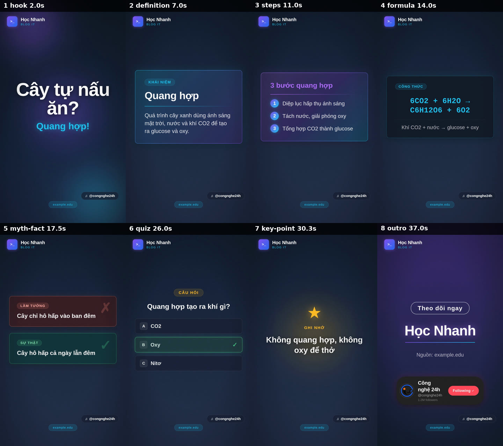

# Dan Tech Academy × md-to-video-hyperframes — Phân tích khoảng trống & lộ trình nâng cấp

> **Ngày:** 2026-09-24
> **Phạm vi:** toàn bộ pipeline (schema, composer, CSS/GSAP, audio, TTS, skill), đối chiếu với năng lực thật của HyperFrames (0.4.34 đang dùng, 0.8.71 mới nhất trên npm) và 1 lần render thử `tests/fixtures/sample-lesson-script.json`.
> **Câu hỏi:** repo cần thêm gì để tạo được video bài giảng *thật tốt, hoành tráng, đa phong cách* cho Dan Tech Academy?

---

## 0. Tóm tắt nhanh

- **Hiện trạng:** repo là "máy làm slide có giọng đọc" 60 giây dọc 9:16 — 14 layout đều chỉ có chữ (phần lớn là *chữ trong thẻ*), **cắt cứng** giữa các cảnh, animation chạy xong trong ~2 giây đầu rồi đứng yên, **không nhạc, không SFX, không phụ đề**, và font thiết kế không được tải khi render.
- **Nút thắt gốc không nằm ở CSS mà ở mô hình thời gian:** hình không biết lời đang nói đến đâu. Trong khi dữ liệu để đồng bộ **đã có sẵn** — Edge TTS trả timestamp *từng từ* (`voice/*.srt`) nhưng pipeline bỏ đi.
- **Đòn bẩy lớn nhất đang bị bỏ phí:** registry HyperFrames có **395** block/component (code typing/diff/highlight, flowchart, whiteboard vẽ tay, caption karaoke, 13 nhóm transition + shader, lower-third, logo sting, chart…) và bộ công cụ QA (`lint`, `inspect`, `snapshot`). Repo dùng 3 block, 0 công cụ QA, và kẹt ở HyperFrames 0.4.x (`^0.4.34` không cho lên 0.8.x).
- **Lộ trình:** P0 nền móng & sửa lỗi → P1 đồng bộ theo lời + âm thanh + phụ đề → P2 design system đa phong cách → P3 bộ scene kỹ thuật (code/terminal/sơ đồ) → P4 Markdown-first + long-form 16:9 → P5 lớp "wow" (shader, 3D, mascot).
- **Cập nhật cùng ngày:** các quyết định đã chốt và phần lớn P0–P3 đã được hiện thực trong lesson pipeline v2. Xem [mục 8](#8-quyết-định-đã-chốt--tiến-độ-cập-nhật-2026-09-24).

---

## 1. Hiện trạng — đã kiểm chứng

### 1.1 Pipeline hiện tại

```
script.json (Zod: 5–8 cảnh, hook đầu, outro cuối)
 → TTS từng cảnh (Edge / LucyLab / Vbee / ElevenLabs)
 → ghép audio + 0,3s lặng + trộn SFX (nếu có thư viện)
 → html-composer.ts: nối chuỗi HTML của 14 layout vào 1 index.html
 → copy styles.css (dark-neon | light-pro) + animations.js
 → npx hyperframes render (1080×1920, 30fps) → video.mp4
```

**Nên giữ:** tách *creative (skill/LLM)* ↔ *deterministic (CLI)*; schema Zod chặt; TTS idempotent; đa provider TTS; nguyên tắc "1 ý/cảnh".

### 1.2 Kết quả render thử bài mẫu



| Chỉ số | Kết quả |
|---|---|
| Thời lượng | 39,4s (audio 36,1s — dưới ngưỡng 48s mà chính pipeline đặt) |
| SFX / nhạc | `SFX library: 0 files in 0 categories` → **0 hiệu ứng âm thanh**, không nhạc nền |
| Font | Anton/Inter **không được tải** khi capture → chữ rơi về font hệ thống |
| Thời gian render | ~8 phút (lần đầu, gồm tải Chrome) cho 39s video ≈ 10× thời gian thực trên 4 core |
| Dung lượng | 140 MB (28 Mbps) cho 39s |
| `hyperframes lint` | `composition_file_too_large` (567 dòng — khuyên tách sub-composition) |
| Capture | cảnh báo *slow frame capture* ×3,95 (blur 120px + blend mode + grain động) |

Nhìn contact sheet: 8 cảnh cùng một bố cục (thẻ giữa màn hình trên nền navy), 40–50% khung hình trống, không có hình ảnh/icon/sơ đồ nào; công thức hoá học hiện `6CO2 + 6H2O` không có chỉ số dưới; header ghi "Học Nhanh · BLOG IT" nhưng thẻ follow ở outro lại là "Công nghệ 24h · @congnghe24h · 1.2M followers" (giá trị mặc định trong `src/config.ts`).

### 1.3 Danh sách vấn đề (có bằng chứng)

**Chuyển động**

| # | Vấn đề | Bằng chứng |
|---|---|---|
| M1 | Cắt cứng (jump cut) giữa mọi cảnh | `animations.js:32-33` chỉ `tl.set(opacity 1/0)`; skill của HyperFrames coi transition là *bắt buộc* |
| M2 | Không dùng easing nào → mọi tween là `power1.out` mặc định; 14 layout cùng một kiểu "trượt lên + fade" | 0 lần `ease:` trong `animations.js` |
| M3 | "Vùng chết": mọi entrance xong trong 0,75–2,2s đầu cảnh; cảnh 4–7s có 55–75% thời lượng đứng yên, không ambient motion/camera | offset trong `animations.js` × timing thực tế |
| M4 | Hình không bám lời: steps hiện ở `start+0.6+i*0.18`; quiz lộ đáp án theo công thức `max(1.9, min(dur-1.2, dur*0.6))` | `animations.js:180, 225`. Bài mẫu: cảnh steps dài 2,77s, lời chỉ nói "gồm ba bước chính" → người xem có ~1,5s để đọc 3 bước |
| M5 | Tự giới hạn lỗi thời "chỉ opacity/x/y/scale…, không easing phức tạp" | header `animations.js:4-6`. Skill HyperFrames cho phép color, filter, clipPath, CSS var, 3D, mọi ease; GSAP 3.14 miễn phí toàn bộ plugin (SplitText, DrawSVG, MorphSVG, MotionPath, ScrambleText, Flip…) — đã kiểm có trên CDN |
| M6 | Ken Burns hỏng: `var(--scene-dur)` không được định nghĩa ở đâu → ảnh nền đứng yên | `styles.css:129-132` |
| M7 | Code chết từ spec cũ: `.fx.flash-white-3f`, `.particle-burst`, `.color-flash-accent`, `.gradient-outro-purple`, `.glass-card` | không được composer/animations dùng |

**Hình ảnh & bố cục**

| # | Vấn đề | Bằng chứng |
|---|---|---|
| V1 | Bố cục "thẻ giữa màn hình", 40–50% khung trống | contact sheet |
| V2 | 14/14 layout chỉ có chữ; không có slot ảnh/icon/sơ đồ/code highlight (trừ og:image của hook) | `html-composer.ts` |
| V3 | Branding cứng & lẫn lộn: "BLOG IT", icon `>_`, `CườngIT`, `Công nghệ 24h`, "Nguồn:", thẻ TikTok | `html-composer.ts:17-21, 92-95, 428`; `config.ts` |
| V4 | Theme = 2 file CSS ~1.000 dòng copy nhau, không có design token; schema lộ tên màu `color: "cyan" \| "purple"` | `styles*.css`; `script-schema.ts:18` |
| V5 | Nền linear-gradient toàn khung trên nền tối → dễ banding H.264 (HyperFrames khuyên radial + glow cục bộ) | `.shell-bg`, `.gradient-news-dark` |

**Chữ (typography)**

| # | Vấn đề | Bằng chứng |
|---|---|---|
| T1 | Font tải từ Google Fonts CDN lúc render, không nhúng → kết quả phụ thuộc mạng/môi trường (render thử bị rơi font) | `base.html.tmpl:9`, `styles.css:5` |
| T2 | `@import` DM Sans nằm giữa file CSS → không hợp lệ, bị trình duyệt bỏ qua (thẻ TikTok không có font) | `styles.css:515`, `styles.light-pro.css:541` |
| T3 | Bebas Neue (fallback của `stat-value`) **không có subset tiếng Việt** | Google Fonts metadata |
| T4 | Bẫy tiềm ẩn: compiler HyperFrames tự nhúng font "deterministic", nhưng cả 42 file font nhúng sẵn chỉ có ~230 glyph Latin — **0/40** ký tự Việt (ư ơ đ ệ ở…). Hiện chưa kích hoạt vì CSS nằm ở file ngoài; khi chuyển sang sub-composition/CSS inline sẽ vỡ dấu. Alias ngầm: "bebas neue" → League Gothic, "courier new" → JetBrains Mono | kiểm bằng fontTools; hàm `injectDeterministicFontFaces` trong CLI |
| T5 | Chống tràn chữ chỉ bằng giới hạn ký tự trong Zod; chưa dùng `fitTextFontSize` / `hyperframes inspect` | `script-schema.ts` |

**Âm thanh**

| # | Vấn đề | Bằng chứng |
|---|---|---|
| A1 | Thư viện SFX không nằm trong repo → clone mới = 0 SFX; script tải từ myinstants.com (kho âm thanh meme) → rủi ro bản quyền cho học viện | log render; `scripts/download-sfx.ts` |
| A2 | Không nhạc nền, không ducking, không chuẩn hoá loudness (−14 LUFS) — spec gốc giao việc này cho CapCut | `docs/superpowers/specs/2026-04-29-auto-news-video-design.md` §1–2 |
| A3 | SFX chỉ đặt ở đầu cảnh + offset cố định, không gắn với sự kiện hình (bullet, reveal, transition) | `pipeline.ts:133-173` |
| A4 | `voice.speed` trong schema không được dùng ở đâu | grep |
| A5 | Phát âm thuật ngữ Anh (API, JSON, Kubernetes, useEffect…) chỉ dựa vào LLM nhớ bảng quy tắc trong SKILL.md, không có lexicon tự động | `create-news-video/SKILL.md` |

**Nội dung & sư phạm**

| # | Vấn đề | Bằng chứng |
|---|---|---|
| C1 | Khung cứng 5–8 cảnh, 48–72s, chỉ 9:16 → không làm được bài 5–20 phút có chương | `script-schema.ts:189-200`, `pipeline.ts:17-18` |
| C2 | Quiz đọc câu hỏi và đáp án liền một hơi: câu hỏi kết thúc ở 2,55s, "Đáp án" bắt đầu ở 3,43s → ~0,9s để suy nghĩ; highlight bật lúc 3,49s, trước khi đọc "oxy" (4,15s) | SRT từng từ của cảnh quiz |
| C3 | `formula` dùng monospace cho cả toán lẫn code, 1 dòng ≤60 ký tự, không syntax highlight, không KaTeX/chỉ số dưới — với học viện công nghệ, code là hình ảnh số 1 | contact sheet, ô 4 |
| C4 | Nhãn tiếng Việt viết cứng trong composer ("CÂU HỎI", "LẦM TƯỞNG", "SỰ THẬT", "Nguồn:") | `html-composer.ts:357, 370, 375, 428` |
| C5 | Thiếu khối sư phạm: mục tiêu bài, ôn bài trước, tóm tắt/checklist, bài tập, glossary, tiến độ (chương x/y, bài x/y), điều hướng series | schema |

**Pipeline & công cụ**

| # | Vấn đề | Bằng chứng |
|---|---|---|
| P1 | `rerender.ts` luôn copy `styles.css` (bỏ qua `VIDEO_THEME`) và lặp lại logic của pipeline | `rerender.ts:143` |
| P2 | SRT cấp từng từ đã sinh ra nhưng không dùng cho phụ đề hay timing | `pipeline.ts:82-94` |
| P3 | Không dùng `hyperframes lint/inspect/snapshot/preview`; test chỉ so chuỗi HTML | `package.json`, `src/**/*.test.ts` |
| P4 | 1 file `index.html` nguyên khối → khó tái dùng, khó để agent sửa từng cảnh | lint warning |
| P5 | Kẹt HyperFrames 0.4.x; bản 0.8.71 có thêm shader transitions, beat analyzer, `media-use` (BGM/SFX/icon/logo/LUT/captions), import token/component từ Figma, render cloud (AWS Lambda / Cloud Run / HeyGen) | `npm view hyperframes` |
| P6 | Render ≈10× thời gian thực, 28 Mbps → bài 10 phút ≈ 1,5–2 giờ render, ~2 GB | render thử |

---

## 2. "Video học tập tốt" cần gì — góc sư phạm

### 2.1 Nguyên tắc → yêu cầu kỹ thuật (Mayer, *Multimedia Learning*)

| Nguyên tắc | Nghĩa | Hiện tại | Cần có |
|---|---|---|---|
| Temporal contiguity | Hình xuất hiện đúng lúc lời nói tới | ✗ timing theo công thức | Cue marker + timestamp từng từ |
| Signaling | Chỉ cho người học thấy chỗ quan trọng | Shimmer 1 lần | Marker highlight, khoanh tròn, mũi tên, focus dòng code, làm mờ phần còn lại |
| Segmenting | Chia nhỏ, có nhịp nghỉ | 5–8 cảnh phẳng | Chương + beats trong cảnh + khoảng dừng có chủ đích |
| Modality / Redundancy | Hình + lời hiệu quả hơn đoạn chữ dài + lời | Thẻ định nghĩa 160 ký tự | Chữ ngắn (keyword), sơ đồ; phụ đề dạng keyword/karaoke |
| Spatial contiguity | Nhãn đặt sát hình | — | Annotation gắn vào phần tử (callout, arrow) |
| Pre-training | Giới thiệu thuật ngữ trước khi dùng | `definition` | Glossary chip "thuật ngữ mới" xuyên suốt bài |
| Personalization / Voice | Giọng trò chuyện, tự nhiên | TTS | Giọng theo phong cách + lexicon phát âm |
| Embodiment | Có người/nhân vật dẫn dắt | — | Mascot / avatar / webcam giảng viên (PiP) |
| Retrieval practice | Người học tự nhớ lại | Quiz nói luôn đáp án | Quiz có đồng hồ 3–5s + nhạc chờ, rồi mới reveal |
| Worked example | Ví dụ giải từng bước | `steps` dạng chữ | Code walkthrough từng dòng, terminal chạy thật |

### 2.2 Khung bài giảng đề xuất

- **Long-form 16:9 (5–15 phút):** cold open (một bug/câu hỏi thật) → intro sting 3s → mục tiêu bài (3 ý) → ôn kiến thức nền → *[chương: khái niệm → ẩn dụ/sơ đồ → demo code/terminal → lỗi thường gặp]* × n → thử thách có đếm ngược → tóm tắt checklist → bài tiếp theo + end screen.
- **Short 9:16 (45–75s):** hook 2s → 1 khái niệm → 1 minh hoạ trực quan → 1 câu đố có đếm ngược → takeaway → CTA "xem bài đầy đủ".
- **Một nguồn bài giảng ⇒ 1 video dài + nhiều short** (cắt theo chương, dựng lại bố cục dọc).

### 2.3 Bộ scene cần bổ sung (ưu tiên cho học viện công nghệ)

| Nhóm | Scene | Nội dung | Dựa trên registry HyperFrames |
|---|---|---|---|
| Code | `code-walkthrough` | Syntax highlight (Shiki), hiện/gõ dần, focus dòng theo cue, làm mờ phần còn lại, chú thích bên lề | `code-typing`, `code-highlight`, `code-scroll`, `code-snippet-*` |
| Code | `code-diff` | Trước/sau, bug → fix, dòng đỏ/xanh | `code-diff`, `code-morph` |
| Code | `terminal` | Gõ lệnh + output thật (chạy code lúc build) | `terminal-simulator`, `code-terminal-run`, `typed-prompt` |
| Sơ đồ | `diagram` | Node + mũi tên vẽ dần theo cue (Mermaid/D2 → SVG) | `flowchart`, `flowchart-vertical`, `hw-pipeline`, `svg-stroke-trace` |
| Sơ đồ | `request-flow` | Gói tin chạy client → server → DB | `offset-path-traveler`, `arc-motion-path` |
| CS | `data-structure`, `algorithm` | Mảng, stack, queue, tree, graph; từng bước sort/BFS | tự xây (SVG + GSAP Flip) |
| Dữ liệu | `chart`, `stat` | Bar/line/progress, đếm số | `data-chart`, `animated-bar-chart`, `count-up`, `conic-progress-ring` |
| So sánh | `compare-table` | 2–3 cột, tick/cross lần lượt | `comparison-split` |
| Hình | `image-annotate`, `screenshot` | Ảnh docs/UI + khoanh, mũi tên, zoom | `vox-annotate`, `hw-callout-circle`, `hw-arrow`, `yt-circle-pointer`, `ui-focus-zoom`; `hyperframes capture <url>` |
| UI | `screen-demo` | Quay thao tác web (Playwright) + con trỏ + zoom | `browser-device-stage`, `simulated-cursor` |
| AI | `chat-demo` | Minh hoạ prompt/response | `claude-exchange`, `chatgpt-exchange`, `ai-chat-reveal` |
| Toán | `math` | KaTeX (+ mhchem cho hoá), biến đổi từng bước | tự xây |
| Sư phạm | `objectives`, `recap-checklist`, `glossary`, `challenge` (timer), `next-lesson` | | `marker-checklist-card`, `count-up` |
| Kể chuyện | `analogy` | Icon/minh hoạ + nhãn ("closure giống chiếc ba lô…") | `icon-swap`, `morph-swap` |

---

## 3. "Hoành tráng" cần gì — giá trị sản xuất

1. **Hệ thống chuyển cảnh có ngữ nghĩa.** Mỗi style có 1 transition chính (60–70%) + 1–2 accent. Cùng mạch → push/crossfade nhanh; đổi chương → shutter/cover/whip-pan; cao trào → zoom-through/shader; kết → dip to black. Registry có sẵn `transitions-{push,radial,scale,dissolve,cover,light,distortion,mechanical,grid,3d,blur,destruction,other}`, `whip-pan`, `cinematic-zoom`, `sdf-iris`, `cross-warp-morph`, `light-leak`, `glitch`, `ridged-burn`…; shader qua `@hyperframes/shader-transitions`.
2. **Ngôn ngữ chuyển động.** Mỗi cảnh có 3 pha *build (0–30%) / breathe (30–70%) / resolve*; ≥3 kiểu ease/cảnh; stagger theo thứ tự quan trọng; pha breathe luôn có 1 chuyển động nền (drift, glow "thở", parallax, push-in chậm).
3. **Kinetic typography.** SplitText tách chữ/từ, ScrambleText kiểu hacker cho thuật ngữ, karaoke highlight theo từ đang đọc, headline slam cho hook.
4. **Chiều sâu & camera.** Tối thiểu 3 lớp (nền có xử lý – nội dung – accent/foreground), parallax, push-in/pull-back, "camera" lướt trên một canvas lớn (kiểu Kurzgesagt/Prezi), thẻ nghiêng 3D.
5. **Nền theo style.** Mesh gradient/aurora động, lưới blueprint, giấy whiteboard, bảng phấn, CRT scanline, hạt (PRNG có seed). Registry: `mesh-gradient-bg`, `aurora-drift`, `grain-field`, `halftone-field`, `vfx-liquid-background`…
6. **VFX tiết chế.** Light sweep, bloom, light leak, confetti khi trả lời đúng, shatter khi "phá" lầm tưởng, glitch cho "bug", portal khi sang chương.
7. **Bộ nhận diện Dan Tech Academy.** Logo sting 2–3s, chapter bumper, lower-third (tên bài/giảng viên), watermark, thanh tiến độ chương, end screen YouTube 20s / CTA cho Shorts–TikTok. Registry: `logo-sting`, `yt-logo-intro`, `wordmark-tiles`, `lt-*` (10 kiểu lower-third), `logo-outro`.
8. **Âm thanh — quyết định một nửa cảm giác "hoành tráng".**
   - Nhạc nền theo mood của style (lofi / tech / cinematic / upbeat) từ thư viện có license; lưu metadata license cùng asset.
   - Tự động ducking nhạc dưới giọng (`sidechaincompress`), chuẩn hoá `loudnorm` I=−14 LUFS, TP=−1 dBTP.
   - SFX gắn theo **sự kiện timeline**: whoosh ở transition, pop/tick mỗi bullet, tiếng gõ phím khi code typing, ding khi reveal, success/fail cho quiz, riser trước cao trào, impact ở intro.
   - Căn transition vào phách nhạc (HyperFrames 0.8 có beat analyzer); audio-reactive nhẹ cho nền.
9. **Người dẫn.** Mascot Dan Tech Academy (Lottie/SVG rig — registry có `lottie-character-walk`), avatar AI (HeyGen, cùng hệ sinh thái HyperFrames), hoặc webcam giảng viên PiP.

---

## 4. "Đa phong cách" cần gì — design system

### 4.1 Kiến trúc Style Pack

```
styles/<style-id>/
  style.json        # meta, fonts, vai trò màu, motion profile, transition set, audio mood, nhãn
  tokens.css        # :root { --bg --surface --fg --muted --accent --accent-2 --positive --negative
                    #         --font-display --font-body --font-mono --radius --stroke --glow ... }
  components.css    # override tuỳ chọn theo scene type
  background.html   # công thức nền + ambient motion
  fonts/*.woff2     # self-host, BẮT BUỘC có subset vietnamese, khai báo @font-face tường minh
```

- Scene template chỉ dùng **biến CSS theo vai trò**; schema dùng `tone: primary | secondary | positive | negative | warning` thay cho `color: cyan | purple`.
- **Motion profile là dữ liệu:** `{ ease: { enter: "expo.out", emphasis: "back.out(1.7)", move: "power2.inOut" }, dur: { fast: .25, base: .45, slow: .8 }, stagger: .08, entrances: [...], ambient: "drift" }` → cùng một template nhưng "chuyển động khác tính cách".
- **Transition set:** `{ primary, topicChange, climax, outro }`.
- Chọn style trong `script.json`/frontmatter cấp video, override theo chương/cảnh; `VIDEO_THEME` chỉ còn là giá trị mặc định.
- Mỗi style phải qua checklist: glyph tiếng Việt, contrast WCAG, tràn chữ (`inspect`), ngân sách thời gian render.
- Có thể nhập token thương hiệu từ Figma (`hyperframes tokens`, bản 0.8).

### 4.2 Tám style đề xuất cho Dan Tech Academy

Mọi font dưới đây đã kiểm tra có subset **vietnamese** trên Google Fonts.

| Style | Dùng cho | Màu | Font | Chuyển động | Transition | Âm thanh |
|---|---|---|---|---|---|---|
| **Neon Terminal** | Lập trình, CLI, bảo mật | gần đen + lime/cyan neon | Chakra Petch · JetBrains Mono | nhanh, scramble text, glitch nhẹ | glitch, grid dissolve | synthwave, tiếng phím |
| **Blueprint** | System design, kiến trúc, mạng | xanh bản vẽ + nét trắng, lưới | Space Grotesk · IBM Plex Mono | vẽ nét (DrawSVG), chính xác | wipe, shutter | ambient tech |
| **Whiteboard** | Khái niệm cho người mới | giấy trắng + bút dạ đen/đỏ/xanh | Patrick Hand / Shantell Sans · Be Vietnam Pro | vẽ tay, nét "boil", stop-motion | scribble wipe, lật trang | lofi, tiếng bút |
| **Chalkboard** | Toán, thuật toán, CS nền tảng | bảng xanh đen + phấn | Pangolin / Itim · Be Vietnam Pro | phấn viết dần | khăn lau bảng | lớp học, tiếng phấn |
| **Swiss Clean** | Tutorial công cụ, so sánh, data | trắng/đen + 1 accent | Be Vietnam Pro / Inter · JetBrains Mono | `expo.out`, bám lưới | push, hard cut có chủ đích | tối giản |
| **Cinematic Keynote** | Trailer khoá học, bài mở đầu | đen sâu + vàng/đỏ | Anton / Big Shoulders · Inter | chậm, kịch tính, push-in | cinematic zoom, light leak, shader | epic, riser/impact |
| **Aurora Glass** | AI/ML, sản phẩm hiện đại | aurora tím–xanh + kính mờ | Unbounded / Lexend · Geist Mono | mượt `sine`, liquid glass | cross-warp morph | electronic ambient |
| **Retro Pixel** | Chủ đề vui, game hoá, quiz | 8-bit | VT323 · Be Vietnam Pro | `steps()`, nảy | pixel dissolve | chiptune |

**Font phổ biến nhưng KHÔNG có tiếng Việt (tránh):** Bebas Neue, Fira Code, Caveat, Kalam, Permanent Marker, Press Start 2P, Silkscreen, Orbitron, Rajdhani, DM Sans, Outfit, Sora.

---

## 5. Kiến trúc kỹ thuật cần nâng cấp

### 5.1 Engine đồng bộ theo lời (ưu tiên số 1)

- **Nguồn timestamp:** Edge TTS đã trả timestamp từng từ (đang ghi ra `voice/*.srt` rồi bỏ); ElevenLabs có endpoint `with-timestamps`; LucyLab trả SRT; Vbee → forced alignment bằng `hyperframes transcribe` (word-level).
- **Cue trong lời dẫn:** `"Đầu tiên {s1}ta cài Node. Sau đó {s2}khởi tạo project."` → pipeline gỡ marker trước khi TTS, map marker → thời điểm của từ kế tiếp.
- **Scene = chuỗi beats:** `{ at: "s2", do: "reveal", target: "items[1]" }`, `highlight`, `focusLines`, `draw`, `zoom`, `sfx`.
- **Quiz đúng sư phạm:** `think: 4` → chèn 4s lặng + đồng hồ đếm + nhạc tick → reveal đúng cue "đáp án".
- **Phụ đề:** dùng chính dữ liệu này để sinh caption karaoke/keyword theo style + xuất `.srt/.vtt` cho YouTube.

### 5.2 Scene = sub-composition + tận dụng registry

- Mỗi scene type là 1 file `compositions/<type>.html` (CSS scoped + timeline riêng), nhận dữ liệu qua `data-variable-values`, mount bằng `data-composition-src`.
- Vendor block từ registry bằng `npx hyperframes add <name>`, bọc adapter (schema → variables; chuyển 16:9 ↔ 9:16). Một số item (vd. `vox-annotate`) đã khai báo sẵn `variables` và `syncPoints` — khớp với engine cue.
- Lợi ích: preview/test từng cảnh, agent sửa 1 cảnh không đụng cảnh khác, hết cảnh báo lint.
- Nâng HyperFrames lên 0.8.x (đổi range `^0.4.34`), chạy lại test + render so sánh.

### 5.3 Schema v2 (phác thảo)

```jsonc
{
  "version": "2.0",
  "lesson": { "title": "Closure trong JavaScript", "series": "JS Nâng cao", "episode": 7,
              "level": "intermediate", "objectives": ["…", "…"] },
  "brand": "dan-tech-academy",           // brand kit: logo, màu, handle, end screen
  "style": "neon-terminal",              // style pack
  "formats": ["landscape", "portrait"],  // 16:9 dài + 9:16 short
  "voice": { "provider": "edge-tts", "voiceId": "vi-VN-NamMinhNeural", "rate": "-5%", "lexicon": "tech-vi" },
  "music": { "mood": "lofi-tech", "duck": true },
  "chapters": [{
    "title": "Closure là gì?",
    "scenes": [{
      "type": "code-walkthrough",
      "voice": "Hàm {c1}counter tạo biến count. {c2}Hàm trả về vẫn nhớ count dù counter đã chạy xong.",
      "data": { "lang": "js", "code": "function counter() {\n  let count = 0;\n  return () => ++count;\n}" },
      "beats": [
        { "at": "c1", "do": "focusLines", "lines": [1, 2] },
        { "at": "c2", "do": "focusLines", "lines": [3], "annotate": "closure giữ tham chiếu" }
      ],
      "transition": "auto"
    }]
  }]
}
```

### 5.4 Markdown-first (đúng tinh thần tên repo `md-to-video`)

````md
---
title: Closure trong JavaScript
series: JavaScript Nâng Cao
episode: 7
style: neon-terminal
formats: [landscape, portrait]
objectives: [Hiểu closure là gì, Dùng closure tạo private state]
---

# Closure là gì?

> **Closure** là hàm "nhớ" được biến ở phạm vi nơi nó được tạo ra.

```js {focus: 2-3}
function counter() {
  let count = 0;
  return () => ++count;
}
```

:::quiz{answer=2 think=4}
Gọi hàm trả về 2 lần thì lần thứ hai in ra gì?
- 0
- 1
- 2
:::
````

- Compiler **deterministic**: heading → chapter; blockquote có **thuật ngữ** → definition; code fence → code-walkthrough; fence `mermaid` → diagram; `$$…$$` → math; ảnh → image-annotate; `:::quiz | steps | compare | challenge` → scene tương ứng.
- LLM (skill) chỉ viết lời dẫn, đặt cue, chọn điểm nhấn; giảng viên sửa markdown mà không phải đụng JSON.

### 5.5 Asset pipeline

- **Code:** Shiki (theme theo style) → token HTML → animate từng token/dòng; chạy code trong sandbox để lấy output thật cho `terminal`.
- **Toán/hoá:** KaTeX (+ mhchem) → HTML.
- **Sơ đồ:** Mermaid/D2/ELK → SVG → vẽ nét theo cue.
- **Icon:** Iconify (Lucide/Phosphor/Tabler) inline SVG; icon động bằng Lottie.
- **Ảnh/screenshot:** `hyperframes capture <url>` hoặc Playwright; quay screen demo bằng Playwright video.
- **Minh hoạ:** bộ illustration thống nhất theo style (hoặc sinh AI theo style guide). HyperFrames 0.8 `media-use` có thể resolve BGM/SFX/icon/logo/LUT thành file local có ghi sổ (cần đăng nhập HeyGen CLI).
- Cache theo hash nội dung để rerender nhanh.

### 5.6 Đa định dạng & đầu ra

- `format`: landscape 1920×1080 / portrait 1080×1920 / square 1080×1080; layout responsive + safe zone theo nền tảng (UI TikTok/Shorts che cạnh phải và đáy).
- Xuất kèm: thumbnail, chapters (timestamps YouTube), phụ đề `.srt/.vtt`, mô tả + hashtag, `quiz.json`.
- Đặt bitrate (`--crf` / `--video-bitrate`) theo nền tảng; 28 Mbps hiện tại là quá nặng.

### 5.7 TTS cho tiếng Việt kỹ thuật

- `lexicon.vi.json` áp dụng tự động trước TTS (`API → ây pi ai`, `JSON → giây sơn`, `npm → en pi em`, `SQL`, `Kubernetes`, …) + chuẩn hoá số/phiên bản/ký hiệu — thay vì dựa vào LLM nhớ bảng.
- Tách **chữ hiển thị** và **chữ đọc** ở cấp từ, ví dụ `{{npm|en pi em}}`.
- Áp dụng `speed/rate` thật cho mọi provider; giọng theo style; tuỳ chọn voice clone giảng viên.
- Tuỳ chọn: ASR (whisper) nghe lại để phát hiện đọc sai.

### 5.8 QA tự động

- Sau compose: `hyperframes lint --strict` → `inspect --json` (tràn chữ) → `snapshot --at …` (storyboard 1 ảnh/cảnh để duyệt trước khi render full) → animation map (cảnh báo vùng chết > 1,5s) → contrast audit.
- Visual regression: snapshot PNG cho mỗi scene type × style.
- Test font: tự động kiểm glyph tiếng Việt cho mọi font trong style pack.

### 5.9 Hiệu năng render

- Render theo chương rồi nối (ffmpeg concat) + cache chương không đổi; `--quality draft` khi duyệt; giảm filter nặng (blur 120px, blend mode, grain động) hoặc pre-render nền thành video; `--workers`, `--gpu`; hoặc render cloud (HyperFrames 0.8: Lambda / Cloud Run / HeyGen cloud).

---

## 6. Lộ trình đề xuất

| Giai đoạn | Nội dung | Định nghĩa "xong" | Ước lượng |
|---|---|---|---|
| **P0 – Nền móng & sửa lỗi** | Brand kit Dan Tech Academy (bỏ mọi hardcode) · self-host font có tiếng Việt · sửa Ken Burns, `@import`, theme của `rerender`, `voice.speed` · xoá code chết · easing + transition cơ bản + ambient motion · sound pack có license + nhạc nền + ducking + loudnorm · nới giới hạn cảnh/thời lượng · nâng HyperFrames 0.8 | Bài mẫu render ra có nhạc, SFX, transition, đúng font, đúng thương hiệu | ~1 tuần |
| **P1 – Đồng bộ & phụ đề** | Timestamp từng từ + cue + beats · quiz có thời gian suy nghĩ · caption karaoke · xuất SRT/VTT | Mọi reveal lệch ≤150ms so với từ khoá | 1–2 tuần |
| **P2 – Đa phong cách** | Tokens + motion profile + transition set + nền; 3 style đầu: Neon Terminal, Whiteboard, Swiss Clean | 1 script → 3 video khác hẳn nhau, không sửa template | 1–2 tuần |
| **P3 – Scene kỹ thuật** | code-walkthrough, code-diff, terminal, diagram, chart, compare-table, image-annotate, objectives/recap/challenge | 1 bài JS/React thật render trọn vẹn | 2–3 tuần |
| **P4 – Markdown-first & long-form** | Compiler `lesson.md`, chương, 16:9, end screen, thumbnail, chapters, auto-cut short | 1 file `.md` → 1 video dài + 3 short | ~2 tuần |
| **P5 – Lớp "wow"** | Shader transition, 3D/WebGL, mascot/Lottie, avatar, audio-reactive, camera canvas | theo từng tính năng | liên tục |

**Quick wins (≤1 ngày mỗi việc):** thay branding cứng; self-host Be Vietnam Pro + JetBrains Mono có subset Việt; thêm `ease` đa dạng + crossfade/push giữa cảnh; nhạc nền + ducking; dùng SRT từng từ để lộ bullet/đáp án đúng lúc; đặt `--crf` hợp lý.

---

## 7. Các quyết định cần chốt

1. Định dạng chủ lực: YouTube 16:9 dài, Shorts/TikTok 9:16, hay cả hai?
2. Chủ đề chính của Dan Tech Academy (web, AI, DevOps, CS nền tảng…) → quyết định scene nào làm trước.
3. Brand kit đã có chưa (logo SVG, màu, font, giọng văn)?
4. Giọng đọc: Edge TTS miễn phí hay đầu tư ElevenLabs / voice clone giảng viên?
5. Có dùng mascot / avatar / webcam giảng viên không?
6. Nguồn nhạc/SFX: thư viện miễn phí có license (Pixabay, YouTube Audio Library) hay thuê bao (Epidemic Sound, Artlist)?

---

## 8. Quyết định đã chốt & tiến độ (cập nhật 2026-09-24)

**Quyết định của Dan Tech Academy**

| # | Câu hỏi | Chốt |
|---|---|---|
| 1 | Định dạng | Cả hai: YouTube 16:9 (bài dài, có chương) và Shorts 9:16 |
| 2 | Chủ đề | Lập trình và kiến trúc phần mềm, tập trung mobile fullstack (Kotlin/Android, Clean Architecture, backend cho mobile) |
| 3 | Brand kit | Lấy từ dantech.academy: logo wordmark, màu #0091FF / #00BBBD / #47C038, Be Vietnam Pro + Geist Mono |
| 4 | Giọng đọc | Làm cả hai: **free** (Edge TTS + từ điển thuật ngữ) và **clone** (giọng giảng viên qua ElevenLabs `eleven_v3` hoặc LucyLab) |
| 5 | Mascot / avatar | Có: mascot **Dan Bot** dựng sẵn, có thể thay bằng ảnh PNG theo pose |
| 6 | SFX / nhạc | Thư viện riêng đặt trong thư mục, **chọn theo tên file** để khớp mood và hiệu ứng |

**Đã làm (lesson pipeline v2: `src/lesson/`, `npm run lesson`)**

| Hạng mục | Trạng thái |
|---|---|
| Brand kit, font tiếng Việt tự host (5 họ font, subset `vietnamese`) | ✅ |
| Schema v2: bài → chương → cảnh, 15 loại cảnh, cue trong lời thoại, beats | ✅ |
| Đồng bộ theo từng từ (Edge WordBoundary, ElevenLabs timestamps, SRT LucyLab, ước lượng) + lexicon giữ offset | ✅ |
| Quiz có đếm ngược `{pause:N}` + lộ đáp án `{answer}` | ✅ |
| Âm thanh: SFX theo sự kiện và theo tên file, nhạc loop + sidechain ducking, loudnorm −14 LUFS | ✅ |
| 4 style (dantech, blueprint, whiteboard, terminal), 9 kiểu chuyển cảnh, ambient motion | ✅ |
| Cảnh kỹ thuật: code (Shiki, gõ phím, focus + note), diff, terminal, diagram tự bố cục + packet, layers, phone, compare | ✅ |
| 16:9 + 9:16 từ một script; caption karaoke; SRT/VTT; chapters YouTube | ✅ |
| Mascot Dan Bot: pose wave/point/think/celebrate, mấp máy theo lời, đổi màu theo style | ✅ |
| Storyboard + preview nhanh, `hyperframes lint` sạch lỗi | ✅ |
| Skill `create-lesson-video` v2 (+ bản `.agents`), `voice:clone`, `audio:catalog`, `sounds:starter` | ✅ |
| Sửa lỗi pipeline tin tức cũ: Ken Burns, `@import`, theme của `rerender`, `voice.speed`, branding mặc định | ✅ |

Bài mẫu `examples/lessons/repository-pattern`: 15 cảnh, 157 s (16:9) và 154 s (9:16).
Render 1080p30 mất ~14–15 phút mỗi định dạng trên 4 nhân, ra ~25 MB, âm thanh
−14,3 LUFS và true peak −1,8 dBTP.


**Việc tiếp theo**

1. Đưa thư viện SFX và nhạc thật vào `assets/sfx/` và `assets/music/` theo quy ước tên, rồi chạy `npm run audio:catalog`.
2. Clone giọng giảng viên: `npm run voice:clone -- --name "…" samples/*.mp3 --save`, sau đó render lại bài mẫu với `"voice": { "profile": "clone" }`.
3. Thiết kế mascot chính thức (PNG theo pose) nếu muốn thay robot dựng sẵn.
4. P4: compiler `lesson.md` → script v2, tự cắt Shorts từ bài dài, thumbnail tự động.
5. Nâng HyperFrames 0.8.x: shader transitions, render cloud để bài 10–20 phút không phải chờ lâu.
6. Thêm cảnh: chart/benchmark, sequence diagram (request/response theo thời gian), bài tập "thử tự làm".

