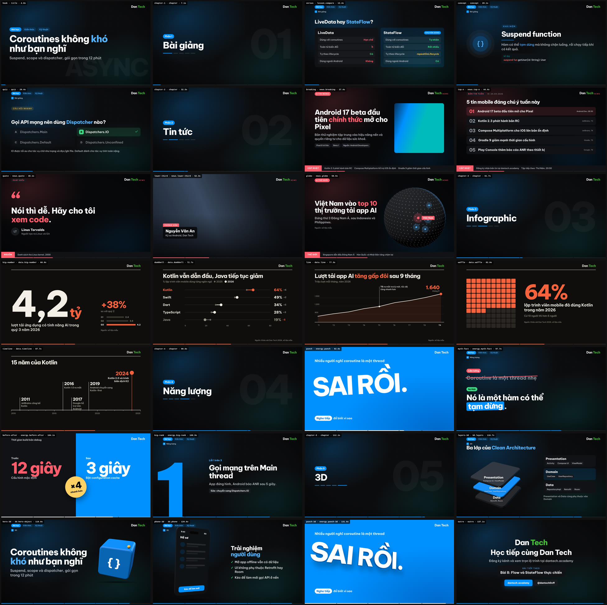
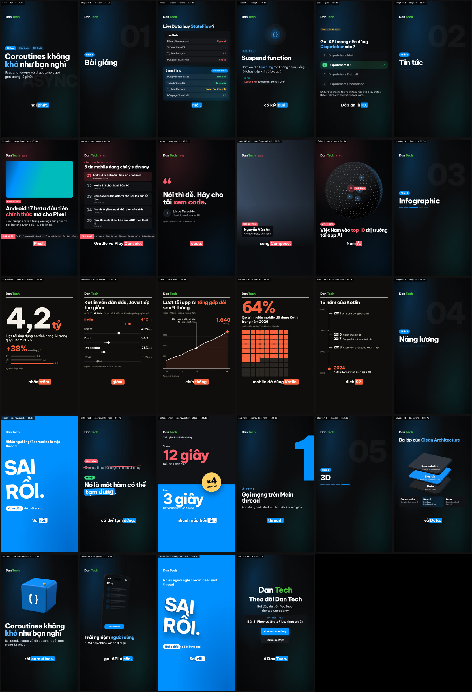

# Dan Tech: video template system

The Dan Tech template system from the Claude Design handoff (`Dan Tech Templates.dc.html` and `TEMPLATES.md`), implemented in the lesson pipeline. Each template is a scene `type` in `script.json`, named by its catalog id (`news.breaking`, `data.dumbbell`…), and renders in 16:9 and 9:16.

- Every template in both formats: [`examples/lessons/templates-showcase/script.json`](../../examples/lessons/templates-showcase/script.json). Run `npm run lesson:frames -- examples/lessons/templates-showcase/script.json` for a storyboard in seconds, with no TTS.
- Fields and limits: [scene catalog](../../.claude/skills/create-lesson-video/reference/scenes.md#template-families). The schema is the source of truth: `src/lesson/schema-templates.ts`.

<b>9:16</b>

## Hard rules

These are built into the `dantech` style and the templates; a script cannot break them by accident.

- The brand is "Dan Tech", never "Academy". The logo is a text wordmark: `Dan` in the ink colour and `Tech` in #47c038. On accent backgrounds the whole wordmark is white. (`brand.json` → `wordmark`)
- One font everywhere: Be Vietnam Pro 500/600/700/800. The `dantech` style has no monospace, including code.
- No borders. Layers are separated by fills (#101216, #171a20).
- No dot separator (·). The pipeline joins with commas.
- No eyebrow or kicker labels. Lesson scenes carry pills instead: `lesson.pills`, e.g. `["Bài học", "Kiến thức", "Kỹ thuật"]`; the first one is filled. The default is "Bài học" plus the level.
- Breaking news shows no date. Every number states its source: `source` is required on `data.*`.
- At most one keyword per sentence: the `keyword` field, which must appear in the text it colours.
- Data titles are written as a conclusion ("Kotlin vẫn dẫn đầu, Java tiếp tục giảm").
- No mascot for the Dan Tech brand. Other brand kits can still define one.

## Families

The family decides the scene background, the shell (logo, NEWS tag, pills, progress bar colour) and the karaoke caption colours. The runtime switches the shell mid-transition.

| family | types | background | accent |
|---|---|---|---|
| lesson | classic scenes, `lesson.*`, `energy.myth-fact`, `energy.big-rank`, `3d.*` | #07080a, blue/teal glow, dot grid | #0091ff (soft #54b3ff) |
| news | `news.*` | #07080a, red/blue glow; `news.breaking` adds the dot grid | #ff5d6c |
| data | `data.*` | #0f0e0c flat, 3px rule under the logo | #f6623d (the design's oklch(0.68 0.19 35)) |
| energy | `energy.punch`, `energy.punch-3d`, `energy.before-after` | full-bleed accent (#0091ff, or #ff5d6c with `tone: "red"`) | white |

State colours: positive #3ddc84, negative #ff5d6c, warning #ffc53d.

## Catalog

| id | fields | notes |
|---|---|---|
| `lesson.hook` | `title`, `keyword`, `subtitle`, `ghost`, `pills` | Alias of `title`. Pills sit above the title; `ghost` is the giant faded word. |
| `lesson.compare` | `title`, `keyword`, `left` / `right` { `name`, `badge`, `rows[label, value, tone]` } | The side with a `badge` gets the accent fill. `{n}` reveals row n on both sides. |
| `lesson.concept` | `term`, `definition`, `keyword`, `example` | Alias of `concept`. |
| `lesson.quiz` | `question`, `options`, `answer`, `explain` | Alias of `quiz`; the answer card fills green. |
| `lesson.outro` | `outro.title`, `outro.subtitle`, `outro.next`, `outro.cta[2]` | The automatic outro; the fields override the brand CTA. |
| `news.breaking` | `label`, `headline`, `keyword`, `sub`, `facts[]`, `image`, `ticker[]` | Without `image` the text takes the full width. |
| `news.top-n` | `label`, `period`, `title`, `items[title, source, time]` (2–5), `ticker[]` | `{n}` reveals item n. |
| `news.quote` | `quote`, `keyword`, `person`, `role`, `avatar`, `source` | 16:9 shows the source in the ticker ("NGUỒN"). |
| `news.lower-third` | `media`, `tag`, `name`, `role` | Photo with a slow Ken Burns move. |
| `news.globe` | `headline`, `keyword`, `sub`, `markers[lat, lon, label, primary]`, `ticker[]`, `source` | three.js dot globe; turns to the primary marker. |
| `data.big-number` | `value`, `unit`, `label`, `delta{value, sub}`, `series[label, value]`, `source` | The value counts up; the last series bar is the accent. |
| `data.dumbbell` | `title`, `keyword`, `subtitle`, `legend[2]`, `rows[label, a, b, highlight]`, `axisMax`, `unit`, `source` | Falling rows are muted, with the delta in the accent. |
| `data.line` | `title`, `keyword`, `subtitle`, `points[]`, `labels[]`, `annotation{i, text}`, `lastLabel`, `source` | Three nice gridlines; the line draws in from the left. |
| `data.waffle` | `percent`, `label`, `sub`, `source` | 10×10 grid. |
| `data.timeline` | `title`, `range[start, end]`, `events[year, text]` | Events sit at their real position in time; the last one is highlighted. |
| `energy.punch` | `context`, `punch` (1–3 words), `cta{button, text}`, `tone` | At most about 1.5 s of narration; the pipeline warns when it runs long. |
| `energy.punch-3d` | same as `energy.punch` | The words are extruded in three.js, slam in and shake. |
| `energy.myth-fact` | `myth`, `fact`, `keyword`, `labels[2]` | The myth is struck through and the fact lands at the `{fact}` cue. |
| `energy.before-after` | `label`, `before{value, sub, label}`, `after{…}`, `multiplier{value, sub}` | The "after" half and the badge land at the `{after}` cue. |
| `energy.big-rank` | `rank`, `total`, `noun`, `title`, `detail`, `fix` | "Lỗi 1 trên 3" is built from `noun`, `rank` and `total`. |
| `3d.layers` | `title`, `keyword`, `layers[name, items]` (top to bottom), `core`, `rule` | Plates stack in three.js; a packet rides between them; `{n}` drops layer n in. |
| `3d.hero-object` | `title`, `keyword`, `subtitle`, `model`, `symbol` | A code cube on a perspective grid floor, with the hook beat. |
| `3d.phone` | `title`, `keyword`, `points[]`, `image` or `ui{appBar, rows, button}` | The phone turns from a steep angle to the design pose; the screen is a texture. |

## Energy rules

1. **Pace.** Shorts scenes run 2–3 s and lesson scenes at most 8 s. Every narration sentence produces at least one visual change (a cue).
2. **Hook, first 3 s.** Open with a question (`lesson.hook`), a shock number (`data.big-number`), a contradiction (`energy.myth-fact`) or a before/after (`energy.before-after`). Never open on the logo: `"intro": "auto"` already places the logo sting after the first scene.
3. **Pattern interrupt.** Put one `energy.*` scene every 20–30 s. `energy.punch` lasts at most 1.5 s.
4. **Colour rhythm.** After every 3–4 dark scenes, one full-bleed accent scene.
5. **Numbers** count up from 0 over 0.6 s. Bars and lines draw in from the left.
6. **One SFX per reveal.** Keyword sweeps play `ding` (the `highlight` event); energy scenes play one `impact`.
7. **Hook beat** (styles with `"motion": { "hook": "beat" }`, i.e. `dantech` and `dantech-punch`):
   1. 0.00 s: accent flash at 35% for 0.2 s (whoosh).
   2. 0.18 s: the first word pops from scale 1.15 with back.out(2.2) (pop).
   3. 0.45 s: the other words rise with a 0.05 s stagger, and a bar sweeps across the keyword (ding).
   4. The whole scene zooms slowly from 1.00 to 1.05 (sine.inOut).

## Style `dantech-punch`

`"style": "dantech-punch"` extends `dantech`: about 40% faster motion (`fast` 0.22 s, `base` 0.4 s), a harder emphasis ease (back.out(2.2)), shorter holds and louder SFX. It is defined in `src/lesson/styles/dantech-punch/style.json` (`"extends": "dantech"`).

## 3D (three.js)

- **Layer order:** background → three.js canvas → HTML content → captions, shell and progress.
- **Timing:** every frame is a pure function of timeline time. Each 3D scene registers one tween over its visible range, and its `onUpdate` poses the models and renders. There is no `requestAnimationFrame`, `Clock` or `Date.now()`, and all randomness is seeded.
- **One renderer:** a single shared WebGL renderer draws each 3D scene and copies the frame into that scene's canvas, so a lesson can have any number of 3D scenes.
- **Models** are built in code (low-poly, `MeshStandardMaterial` with roughness 0.55–0.9 and metalness 0, brand colours only): layer stack, code cube, phone, dot globe, and layered extruded text for `energy.punch-3d`.
- **Lighting:** a hemisphere fill, a key light from the top left, and a #54b3ff rim light from behind.
- **Text stays in HTML.** Layer names and globe labels are HTML pinned to projected 3D points. Only `energy.punch-3d` (1–3 words) and the phone's screen texture draw text in 3D.
- **Loading:** three.js is bundled from the `three` package as `vendor/three.js` (a classic script) and is only added to lessons that have 3D scenes. HyperFrames renders with SwiftShader WebGL, and so does the storyboard. If WebGL is unavailable, the storyboard warns and the 3D layer stays empty.
